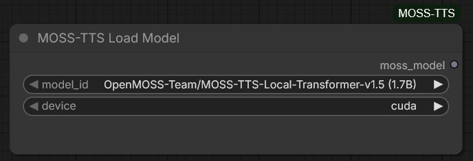
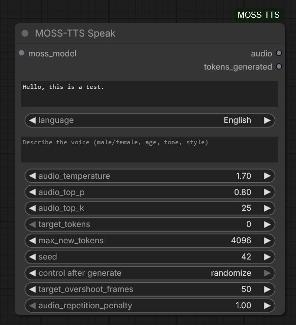
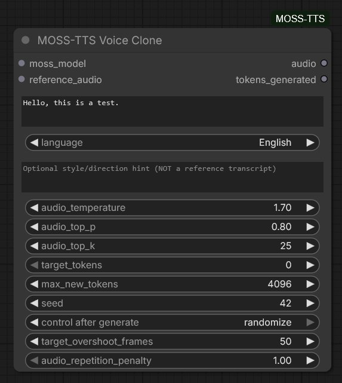
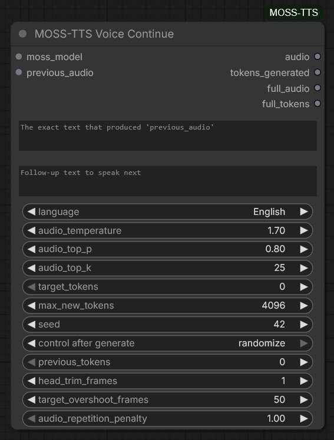
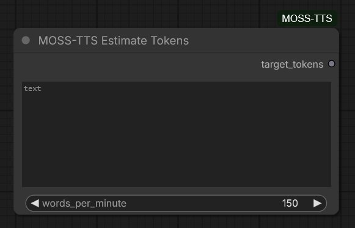
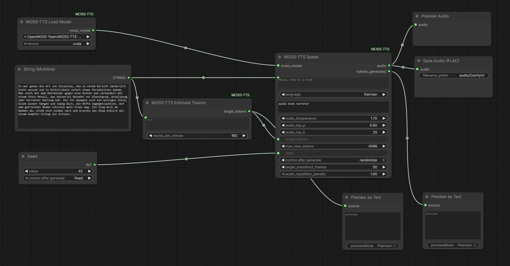
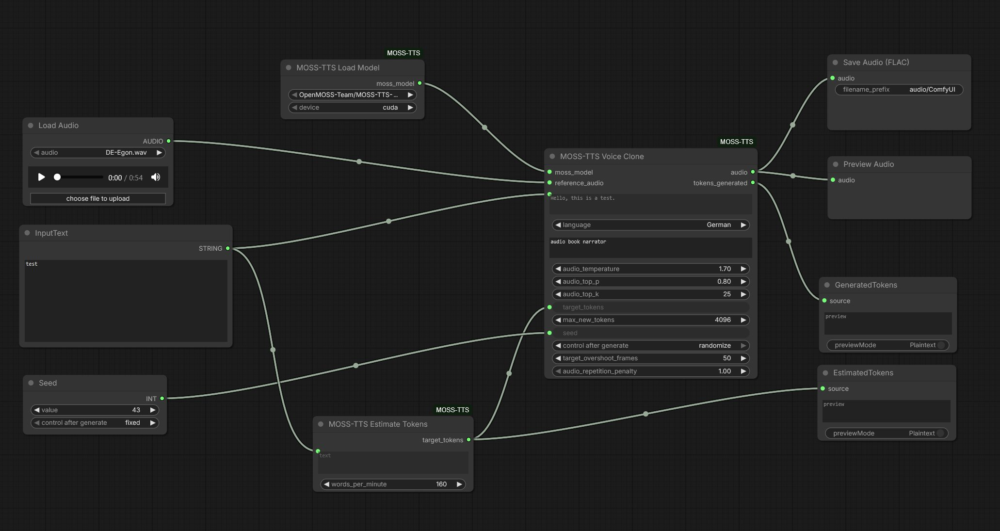

# ComfyUI-MOSS-TTS-1.5

ComfyUI custom nodes for [**MOSS-TTS-Local-Transformer-v1.5**](https://huggingface.co/OpenMOSS-Team/MOSS-TTS-Local-Transformer-v1.5) by [OpenMOSS](https://github.com/OpenMOSS).
Five lean nodes for reference-free TTS, zero-shot voice cloning, deterministic duration steering, and audio continuation — no fine-tuning, no separate reference-transcript dance.

- **31 languages** (with explicit language tag support)
- **Stereo output** at the loaded model's native rate (48 kHz for the 1.7B Local-Transformer, 24 kHz for the 8B MOSS-TTS)
- **Reference-free synthesis** via a plain-text instruction ("male, warm, elderly narrator") — no reference audio needed
- **Zero-shot voice cloning** from a single reference clip
- **Hard duration control** via `target_tokens` (empirically verified — MOSS obeys it precisely)
- **Continuation mode** — extend a previously generated clip in the same voice
- **Audio repetition penalty** (v0.5.1) — optional `audio_repetition_penalty` input on all generate nodes, forwarded to MOSS's native logits penalty. Mild values (1.05–1.15) suppress droning / tempo-freeze / looping-syllable outliers without flattening prosody.
- **Text → token estimator** so the token count doesn't have to be a guess

The model itself is Apache-2.0 released by OpenMOSS-Team. This nodepack is MIT.

---

## Requirements

- ComfyUI running on a machine with a CUDA GPU (~12 GB VRAM in `bfloat16`, measured on RTX 5090)
- Python 3.10+
- `transformers >= 5.0.0` (v5.5.x recommended; the same range MOSS's official code targets)
- `torch`, `torchaudio` (whatever your ComfyUI already ships with)
- ~9.1 GB free disk for the model weights (auto-downloaded from Hugging Face)

That's it — no extra CUDA extensions, no custom kernels.

## Installation

```bash
cd ComfyUI/custom_nodes
git clone https://github.com/eehrich/ComfyUI-MOSS-TTS-1.5.git MOSS-TTS-ComfyUI
```

Restart ComfyUI. The first `MOSS-TTS Load Model` execution will download the checkpoint (~9.1 GB) into your Hugging Face cache.

### Known install gotcha — `configuration_moss_audio_tokenizer.py` dataclass ordering

On Python 3.11+ both audio tokenizers used by MOSS v1.5 (`OpenMOSS-Team/MOSS-Audio-Tokenizer-v2` for the 1.7B Local-Transformer, `OpenMOSS-Team/MOSS-Audio-Tokenizer` for the 8B MOSS-TTS variant) declare their dataclass fields without defaults **after** the parent class already added defaulted fields, so `dataclass(...)` raises:

```
TypeError: non-default argument 'sampling_rate' follows default argument 'problem_type'
```

Fix once, after the first failed load, in the auto-downloaded file at either
`~/.cache/huggingface/modules/transformers_modules/OpenMOSS_hyphen_Team/MOSS_hyphen_Audio_hyphen_Tokenizer_hyphen_v2/<hash>/configuration_moss_audio_tokenizer.py` (needed for the 1.7B Local-Transformer)
or `~/.cache/huggingface/modules/transformers_modules/OpenMOSS_hyphen_Team/MOSS_hyphen_Audio_hyphen_Tokenizer/<hash>/configuration_moss_audio_tokenizer.py` (needed for the 8B MOSS-TTS)
— give each of these class fields a `= None` default:

```python
sampling_rate: int = None
downsample_rate: int = None
causal_transformer_context_duration: float = None
encoder_kwargs: list[dict[str, Any]] = None
decoder_kwargs: list[dict[str, Any]] = None
number_channels: int = None
enable_channel_interleave: bool = None
attention_implementation: str = None
compute_dtype: str = None
codec_weight_dtype: str = None
quantizer_type: str = None
quantizer_kwargs: dict[str, Any] = None
```

Nothing behavioural changes — the real defaults still come from the class's `__init__`.

---

## Nodes

All five nodes live under the top-level **`MOSS TTS 1.5`** category in the ComfyUI menu.

### `MOSS-TTS Load Model`



Loads the processor + model and caches the instance in-memory across runs.
Subsequent workflow queues re-use the already-loaded model — no re-load penalty.

| Input | Type | Default | Notes |
|---|---|---|---|
| `model_id` | enum | `…MOSS-TTS-Local-Transformer-v1.5 (1.7B)` | `…MOSS-TTS-Local-Transformer-v1.5 (1.7B)` — MossTTSLocal, **48 kHz** stereo output, ~12 GB VRAM bf16. `…MOSS-TTS-v1.5 (8B)` — MossTTSDelay, **24 kHz** stereo output, ~22 GB VRAM. Same API, 31 languages, same duration semantics. Each node reads the actual sample rate from `processor.model_config.sampling_rate` at load time and stamps it on all output audio — no manual configuration needed. The `(1.7B)` / `(8B)` suffix is a UI label only; it is stripped before the HF `from_pretrained` call. |
| `device` | `cuda` \| `cpu` | `cuda` | Falls back to `cpu` when CUDA is unavailable |

`dtype` is picked automatically: **bfloat16 on CUDA** (MOSS's training precision — running in float32 gains no quality, running in float16 risks numerical overflow), **float32 on CPU** (bfloat16 CPU kernels are patchy).

**Output**: `MOSS_MODEL` — pass to any of the Speak / Voice Clone / Voice Continue nodes.

### `MOSS-TTS Speak`



Text-to-speech with no reference audio. MOSS uses its trained no-reference path (a literal `"None"` placeholder in the prompt) and picks a voice based on `language` + `instruction`. `instruction` is your only voice-steering knob here.

| Input | Type | Default | Notes |
|---|---|---|---|
| `moss_model` | MOSS_MODEL | — | From the loader |
| `text` | STRING | `Hello, this is a test.` | Multiline |
| `language` | enum | `English` | Also nudges MOSS toward a language-typical base voice |
| `instruction` | STRING | `""` | Voice description — e.g. `"male, warm, elderly narrator"`, `"young female, cheerful, energetic"`, `"deep voice, dramatic, slow"`. Without it, MOSS picks whatever the training-data default was for the language. |
| `audio_temperature` | FLOAT | `1.7` | Sampling temperature |
| `audio_top_p` | FLOAT | `0.8` | Nucleus sampling |
| `audio_top_k` | INT | `25` | Top-k sampling |
| `target_tokens` | INT | `0` | Target duration in audio frames (12.5 fps). `0` = model decides via EOS. |
| `max_new_tokens` | INT | `4096` | Safety cap on generated audio frames |
| `seed` | INT | `42` | Random seed |
| `audio_repetition_penalty` | FLOAT | `1.0` | *(optional)* Penalty on recently generated audio tokens. `1.0` = off. Mild values (`1.05`–`1.15`) suppress the classic AR-TTS failure modes — droning, tempo freeze, smeared/looping syllables — while leaving normal prosody untouched. Above ~`1.3` can distort legitimately repeated sounds. |

**Outputs**: `audio` (stereo at the model's native sample rate) + `tokens_generated` (INT).

### `MOSS-TTS Voice Clone`



Generates speech from `text` in the voice of `reference_audio`.

| Input | Type | Default | Notes |
|---|---|---|---|
| `moss_model` | MOSS_MODEL | — | From the loader |
| `reference_audio` | AUDIO | — | ComfyUI `AUDIO` type (`LoadAudio`, another node's output, etc.) |
| `text` | STRING | `Hello, this is a test.` | Multiline |
| `language` | enum | `English` | Full 31-language list: Arabic, Cantonese, Chinese, Czech, Danish, Dutch, English, Finnish, French, German, Greek, Hebrew, Hindi, Hungarian, Italian, Japanese, Korean, Macedonian, Malay, Persian (Farsi), Polish, Portuguese, Romanian, Russian, Spanish, Swahili, Swedish, Tagalog, Thai, Turkish, Vietnamese. See [MOSS README](https://huggingface.co/OpenMOSS-Team/MOSS-TTS-Local-Transformer-v1.5) for language codes / flags. |
| `instruction` | STRING | `""` | Optional free-form style/direction hint. **Not** a reference transcript — MOSS has no reference-text channel. |
| `audio_temperature` | FLOAT | `1.7` | Sampling temperature |
| `audio_top_p` | FLOAT | `0.8` | Nucleus sampling |
| `audio_top_k` | INT | `25` | Top-k sampling |
| `target_tokens` | INT | `0` | Target duration in audio frames (12.5 fps → 375 ≈ 30 s, 750 ≈ 60 s). `0` = disabled, model decides via EOS. See [Duration control](#duration-control). |
| `max_new_tokens` | INT | `4096` | Safety cap on generated audio frames. MOSS treats this as its internal `frame_budget` at 12.5 fps → default `4096` caps output at ~5 min. |
| `seed` | INT | `42` | Random seed. Same seed + same inputs → identical output. |
| `audio_repetition_penalty` | FLOAT | `1.0` | *(optional)* Penalty on recently generated audio tokens. `1.0` = off. Mild values (`1.05`–`1.15`) suppress the classic AR-TTS failure modes — droning, tempo freeze, smeared/looping syllables — while leaving normal prosody untouched. Above ~`1.3` can distort legitimately repeated sounds. |

**Outputs**:

- `audio` — stereo AUDIO at the model's native rate (48 kHz for 1.7B, 24 kHz for 8B), ready for `PreviewAudio` / `SaveAudio`
- `tokens_generated` — INT, number of audio frames actually produced (divide by 12.5 for seconds)

### `MOSS-TTS Voice Continue`



Extends a previously generated MOSS clip. MOSS is a **prefix-continuation** model — it needs the *original text* that produced `previous_audio` so it can locate where in the script the audio stopped, then produce audio for the follow-up text. The node concatenates `previous_text + " " + text` internally and hands the full script + prior audio to MOSS. Voice is inherited from the prior audio (no separate reference).

| Input | Type | Default | Notes |
|---|---|---|---|
| `moss_model` | MOSS_MODEL | — | From the loader |
| `previous_audio` | AUDIO | — | Prior MOSS output (typically another node's `audio` output) |
| `previous_text` | STRING | `""` | **The exact text that produced `previous_audio`.** Word-for-word match matters — wrong prior text → garbled output (MOSS can't align its script position). |
| `text` | STRING | `""` | Follow-up text to speak next. Empty is legal but produces near-instant EOS — supply real text. |
| `language` | enum | `English` | Same list as Voice Clone |
| `audio_temperature` | FLOAT | `1.7` | Sampling temperature |
| `audio_top_p` | FLOAT | `0.8` | Nucleus sampling |
| `audio_top_k` | INT | `25` | Top-k sampling |
| `target_tokens` | INT | `0` | Duration of the **new** segment in frames. `0` = model decides via EOS. Internally the node adds `previous_tokens` (or measured prefix) before sending to MOSS, because MOSS reads its `tokens` hint as TOTAL (prefix + new) in continuation mode. |
| `max_new_tokens` | INT | `4096` | Safety cap on the new segment |
| `seed` | INT | `42` | Random seed |
| `previous_tokens` | INT | `0` | Exact frame count of `previous_audio`. Wire the `tokens_generated` output of the upstream Speak / Voice Clone / Voice Continue node here for a precise handoff. Leave at `0` to measure from the audio duration (≤ 1 frame off due to rounding). |
| `head_trim_frames` | INT | `1` | Extra frames trimmed from the START of the new audio (1 frame ≈ 80 ms at MOSS's fixed 12.5 fps, regardless of the variant's sample rate). MOSS's decoder trims the prefix by sample proportion, and its conv-based codec has a receptive field that leaks the last prefix frame into the returned continuation. Default `1` (~80 ms) removes it in most cases. Set to `0` to disable, higher if bleed persists. |
| `audio_repetition_penalty` | FLOAT | `1.0` | *(optional)* Penalty on recently generated audio tokens. `1.0` = off. Mild values (`1.05`–`1.15`) suppress the classic AR-TTS failure modes — droning, tempo freeze, smeared/looping syllables — while leaving normal prosody untouched. Above ~`1.3` can distort legitimately repeated sounds. |

**Outputs**:

- `audio` — new segment only, head-trimmed. Use for per-segment QC / preview (you hear just the delta).
- `tokens_generated` — INT, frames of the new segment.
- `full_audio` — cumulative: `previous_audio + new` concatenated at the model's native sample rate (48 kHz for 1.7B, 24 kHz for 8B). If `previous_audio` was at a different rate it is resampled to the target before concatenation. Wire into the NEXT Voice Continue's `previous_audio` when the same speaker keeps talking across segments — MOSS's continuation expects the full history so far.
- `full_tokens` — INT, `previous_tokens + tokens_generated`. Wire into the next `previous_tokens` for a precise chain handoff.

Same-speaker chain pattern (segment-by-segment via your backend):

```
seg N:   Voice Continue → audio, full_audio, full_tokens
seg N+1: Voice Continue.previous_audio  <-- (seg N).full_audio
         Voice Continue.previous_tokens <-- (seg N).full_tokens
```

Save both `audio` (for QC / retake of just this segment) and `full_audio` (as the prev handoff to the next segment). Retake with a different seed rebuilds `full_audio` from the same starting prefix.

### `MOSS-TTS Estimate Tokens`



Turns a text into a `target_tokens` estimate you can wire straight into `Voice Clone` / `Voice Continue`.

| Input | Type | Default | Notes |
|---|---|---|---|
| `text` | STRING | `""` | Multiline. Word count via whitespace split; CJK (Chinese/Japanese/Korean) falls back to non-whitespace character count. |
| `words_per_minute` | FLOAT | `150.0` | 150 = calm audiobook narration, 180 = conversational, 220 = fast. For CJK read as characters-per-minute. |

**Output**: `target_tokens` (INT). Formula: `ceil(word_count / (wpm/60) * 12.5)`.

Need slack for punctuation-heavy passages? Chain a ComfyUI math node (`Multiply` / `Add`) after the output — the estimator deliberately has no built-in buffer so you can compose one that scales with the text.

---

## Duration control

MOSS's `build_user_message` accepts a `tokens` field (in audio frames, 12.5 fps). Empirically **MOSS obeys this precisely** — same text with `target_tokens = 100, 200, 400` produces audio of roughly `8, 16, 32 s`. This nodepack exposes it as `target_tokens` on both `Voice Clone` and `Voice Continue`.

Practical uses:

- **Consistent narration pace across a batch**: fix `wpm = 150` in `Estimate Tokens`, MOSS will read every chapter at the same tempo regardless of length.
- **Speech-rate control without style prompting**: chain a multiplier after the estimator. `× 1.4` = slow / dramatic, `× 0.75` = urgent / rushed. Cleaner than adjectives in the `instruction` field.
- **Fixed video/audio slots**: your video shot is 8 s → set `target_tokens = 100`. MOSS fits into that slot.
- **Continuation length steering**: `Voice Continue.target_tokens = 375` → about 30 s of extra audio.

`max_new_tokens` is a separate parameter — a hard cap on `frame_budget` in MOSS's generation loop (see `modeling_moss_tts.py`: `frame_budget = max_new_frames if max_new_frames is not None else max_new_tokens`). Keep it comfortably above `target_tokens` as a runaway fuse; the default `4096` (~5 min at 12.5 fps) is usually plenty.

---

## Example workflows

**Reference-free narration** — Load Model → Speak, with an Estimate Tokens node feeding the duration hint and a Preview/Save on the output:



**Voice clone from a reference clip** — a `Load Audio` reference + Load Model → Voice Clone, again with Estimate Tokens driving `target_tokens`:



The wiring in condensed form:

**Basic voice clone with automatic duration:**

```
[Load Audio]        [MOSS-TTS Load Model]
      \                  /
       > [MOSS-TTS Voice Clone] -> [Save Audio]
                 ^
    [text]  [MOSS-TTS Estimate Tokens] -> target_tokens
```

**Speech-rate control:**

```
[text] -> [Estimate Tokens] -> [Multiply INT × 1.4] -> Voice Clone.target_tokens
```

Same audio reference, same seed, same text — but 40% slower / more dramatic. Or `× 0.75` for urgent.

**Continuation chain:**

```
[LoadAudio ref]  [Load Model]
      \             /
       > [Voice Clone] -> audio ─────────────┐
[part 1 text] -> Voice Clone.text            │
       [Voice Clone] -> tokens_generated ─┐  │
                                          v  v
[part 1 text] -------> Voice Continue.previous_text
                       Voice Continue.previous_audio
                       Voice Continue.previous_tokens (exact prefix len)
[part 2 text] -------> Voice Continue.text
[Estimate Tokens (part 2)] -> Voice Continue.target_tokens
                                          │
                                          v
                             [Save Audio (part 2 only)]
```

Route both the audio and the `tokens_generated` from the upstream node — the token count keeps the prefix length exact (no rounding drift). Voice Clone / Speak / Voice Continue all expose `tokens_generated` for this. Voice Continue sees `part 1 text` as the "you already said this" context, and adds `previous_tokens` to `target_tokens` internally before sending MOSS the total-length hint.

For part 3, feed `part 1 + part 2` as the new `previous_text`, wire Voice Continue's own outputs forward, and so on.

**Or as a standalone Python demo** (what the nodes wrap under the hood):

```python
from transformers import AutoModel, AutoProcessor
import torch, torchaudio

processor = AutoProcessor.from_pretrained(
    "OpenMOSS-Team/MOSS-TTS-Local-Transformer-v1.5",
    trust_remote_code=True,
)
processor.audio_tokenizer = processor.audio_tokenizer.to("cuda")

model = AutoModel.from_pretrained(
    "OpenMOSS-Team/MOSS-TTS-Local-Transformer-v1.5",
    trust_remote_code=True,
    torch_dtype=torch.bfloat16,
).to("cuda")

conv = [processor.build_user_message(
    text="Der Wind hörte auf, noch bevor Tessa Brandt den Grund der Senke erreichte.",
    reference=["voice.wav"],
    language="German",
    tokens=125,   # ~10 s target
)]
batch = processor([conv], mode="generation")
out = model.generate(
    input_ids=batch["input_ids"].to("cuda"),
    attention_mask=batch["attention_mask"].to("cuda"),
    max_new_tokens=4096,
    audio_temperature=1.7, audio_top_p=0.8, audio_top_k=25,
)
audio = processor.decode(out)[0].audio_codes_list[0]
torchaudio.save("out.wav", audio.cpu(), 48000)
```

---

## Performance & memory

Measured on a single-turn 75-character German sentence, RTX 5090 (bf16):

| Phase | Time |
|---|---|
| Processor load (audio tokenizer moved to GPU) | ~21 s |
| Model load (9.1 GB checkpoint → GPU) | ~16 s |
| Generation (4.72 s of audio) | **~2.7 s** |

Load happens once per (model_id, device, dtype). Warm-cache generation is real-time on modern hardware.

VRAM: ~12 GB active weight + activations in `bfloat16` (measured on RTX 5090). Peak spikes with long contexts (e.g. very long text or `max_new_tokens=16384`) can push higher. RTX 3090 (24 GB) has comfortable headroom.

**Reference / prev_audio adds runtime VRAM on top of the 12 GB baseline.** Voice Clone's `reference_audio` and Voice Continue's `previous_audio` are encoded to audio codes by the tokenizer, then held in the transformer's KV cache while the new frames are generated. The overhead scales linearly with the prefix duration:

- At 12.5 fps × 12 codebooks = 150 audio tokens per second
- MOSS-TTS-Local-Transformer-v1.5 has ~24 transformer layers × ~16 attention heads × 64 head_dim, storing K + V in bf16 → roughly **~50 KB of KV cache per audio token**
- Empirically: **~1 GB extra VRAM per ~20 s of prefix audio** on a 1.7B setup, similar order of magnitude on 8B

Practical implications:

- **Very long reference audio** (e.g. a 2-minute calibration clip) at Voice Clone time can add several GB before generation even starts. Keep reference clips in the 5–15 s sweet spot.
- **Voice Continue with a growing history** (chaining segment N as the prefix for segment N+1 with cumulative audio) is the biggest failure mode: VRAM drifts up linearly through a scene and eventually OOMs. If you are chaining segments, pass only the **last** segment's audio as `previous_audio` rather than the concatenation of the whole scene so far. The prefix-continuation semantics still work correctly (see [Voice Continue notes](#moss-tts-voice-continue) — MOSS aligns the prefix at the end of `previous_text` inside the concatenated full script), just with a shorter history.
- Watch `nvidia-smi` during a long Continue chain to spot the drift early; a single-segment prefix stays flat at ~12 GB + a few hundred MB.

---

## Troubleshooting

- **`Can't load the model … pytorch_model.bin`**: your model.safetensors download stalled. Re-run `huggingface_hub.hf_hub_download(repo_id=..., filename="model.safetensors")` explicitly. Often caused by low disk space in `~/.cache/huggingface`.
- **`std::bad_alloc` on `import torchcodec`**: your installed `torchcodec` version was compiled against a different torch. Either match versions (torchcodec 0.8.x with torch 2.8.x, 0.9.x with 2.9.x, 0.10.x with 2.10.x) or `pip uninstall torchcodec`. The MOSS pipeline itself does **not** require torchcodec.
- **`build_user_message() got an unexpected keyword argument 'reference_text'`**: fixed in `0.1.1` — MOSS has no reference-text channel. Use `instruction` for style hints, or rely on `reference` (audio) + `language` alone.
- **Text like `[pause 1.2s]` is spoken as literal words**: MOSS v1.5 has no built-in pause-marker parser (verified against the source — no `pause`/`silence` tokens in `added_tokens.json`, no bracketed-marker regex in `processing_moss_tts.py`). For deterministic gaps, generate two clips and concatenate with a silence spacer in ComfyUI, or use `Voice Continue` in a chain.

---

## License

- **This nodepack**: [MIT](./LICENSE)
- **MOSS-TTS-Local-Transformer-v1.5 model & code**: [Apache 2.0](https://huggingface.co/OpenMOSS-Team/MOSS-TTS-Local-Transformer-v1.5), copyright OpenMOSS-Team.

## Credits

- Model: [OpenMOSS-Team](https://github.com/OpenMOSS) / [MOSS-TTS](https://github.com/OpenMOSS/MOSS-TTS)
- Wrapper: this repo — a thin bridge to ComfyUI's `AUDIO` type and its category tree.

Not affiliated with OpenMOSS. Star the [upstream model](https://huggingface.co/OpenMOSS-Team/MOSS-TTS-Local-Transformer-v1.5) if you like the work.
