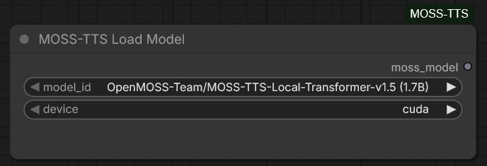
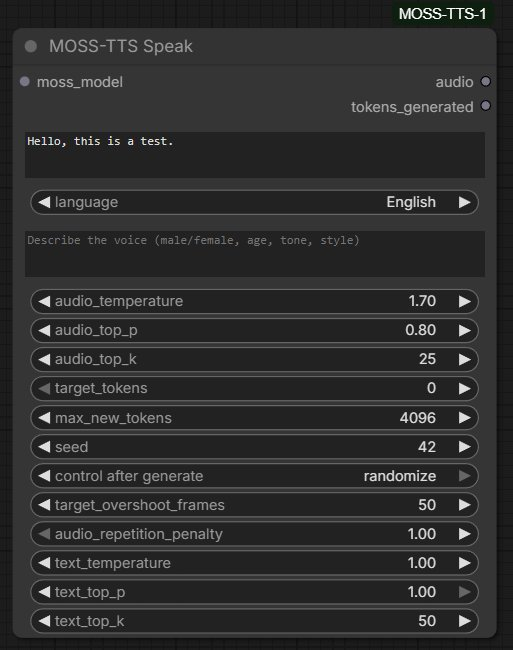
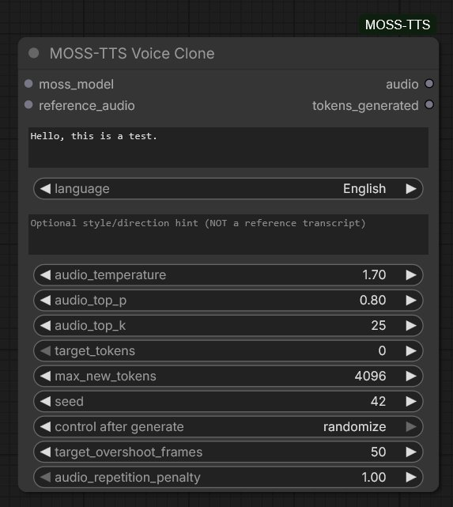
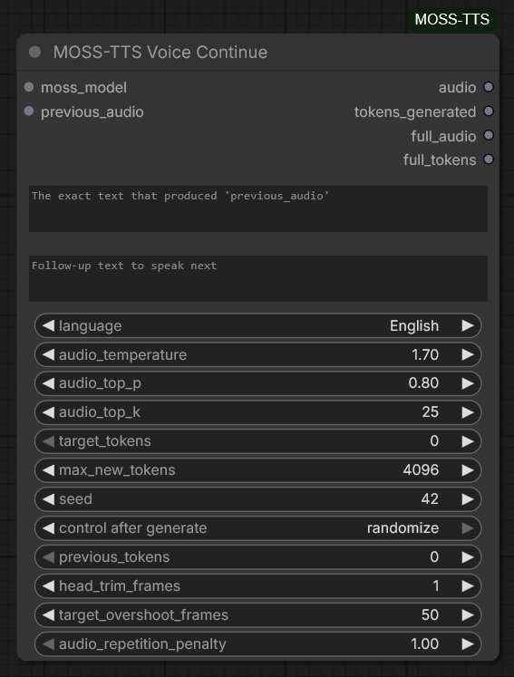
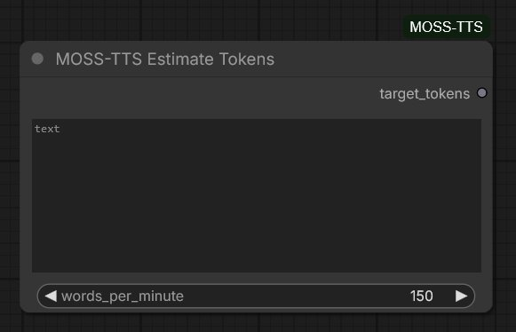
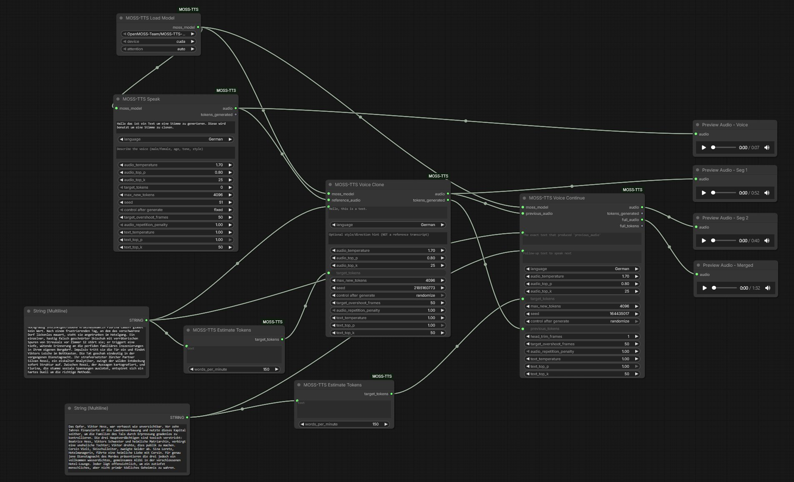
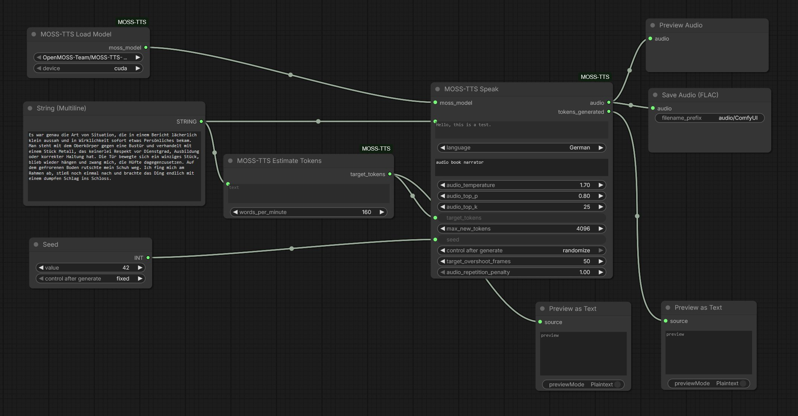
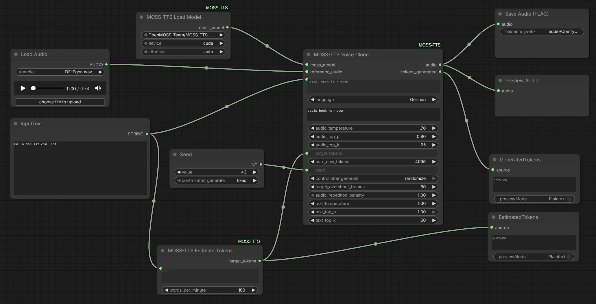

# ComfyUI-MOSS-TTS-1.5

ComfyUI custom nodes for **MOSS-TTS v1.5** by [OpenMOSS](https://github.com/OpenMOSS) — supporting **both** model variants:
[**MOSS-TTS-Local-Transformer-v1.5**](https://huggingface.co/OpenMOSS-Team/MOSS-TTS-Local-Transformer-v1.5) (~1.7B, 48 kHz, the fast default) and the full [**MOSS-TTS-v1.5**](https://huggingface.co/OpenMOSS-Team/MOSS-TTS-v1.5) (~8B, 24 kHz). Pick either in the Load Model dropdown — same nodes, same API.
Ten lean nodes for reference-free TTS, zero-shot voice cloning, deterministic duration steering, audio continuation, and an encode-once token pipeline — no fine-tuning, no separate reference-transcript dance.

- **Two models, one nodepack** — 1.7B Local-Transformer (48 kHz) or 8B full MOSS-TTS (24 kHz), selected per workflow
- **31 languages** (with explicit language tag support)
- **Stereo output** at the loaded model's native rate (48 kHz for the 1.7B Local-Transformer, 24 kHz for the 8B MOSS-TTS)
- **Reference-free synthesis** via a plain-text instruction ("male, warm, elderly narrator") — no reference audio needed
- **Zero-shot voice cloning** from a single reference clip
- **Hard duration control** via `target_tokens` (empirically verified — MOSS obeys it precisely)
- **Continuation mode** — extend a previously generated clip in the same voice
- **Audio repetition penalty** (v0.5.1) — optional `audio_repetition_penalty` input on all generate nodes, forwarded to MOSS's native logits penalty. Mild values (1.05–1.15) suppress droning / tempo-freeze / looping-syllable outliers without flattening prosody.
- **Text-stream samplers** (v0.5.4) — optional `text_temperature` / `text_top_p` / `text_top_k` on all generate nodes to steer MOSS's dual-stream **text** channel (pacing / alignment) independently of the acoustic `audio_*` samplers.
- **Robust attention** (v0.5.5) — no `flash_attn` crash on a fresh install; the loader's `attention: auto` falls back to PyTorch's built-in `sdpa` when flash-attn is absent.
- **Empty-text guard** (v0.5.6) — an empty / whitespace-only prompt fails fast with a clear message instead of making MOSS generate audio until `max_new_tokens` (a multi-minute hang, since it never emits EOS with nothing to say).
- **Encode-once token pipeline** — a `MOSS_TOKENS` type (raw MOSS audio codes) with five nodes (Encode / Decode / Concat / Save / Load Tokens), optional token inputs on Voice Clone / Voice Continue, and a `tokens` output on every generate node. Encode a voice reference a single time and hand MOSS the codes on every later run — the codec encode drops out of the request entirely. `Decode Tokens` closes the loop: listen to what a token file or a concat result actually holds, without generating. See [Token pipeline (encode once)](#token-pipeline-encode-once).
- **Models you already have** (v0.6.2) — put a model under `ComfyUI/models/moss_tts` (or point `extra_model_paths.yaml` at your own library) and it appears in the loader dropdown, loaded straight off disk; `model_path` takes a folder anywhere else. The audio tokenizer counts as well: one lying beside the model is paired with it by sample rate, so a complete offline install downloads nothing at all. See [Using a model you already downloaded](#using-a-model-you-already-downloaded).
- **Text → token estimator** so the token count doesn't have to be a guess

The model itself is Apache-2.0 released by OpenMOSS-Team. This nodepack is MIT.

---

## Requirements

- ComfyUI running on a machine with a CUDA GPU. VRAM in `bfloat16`:
  **~12 GB for the 1.7B Local-Transformer**, **~22 GB for the 8B** full model.
- **Python**: whatever your ComfyUI already runs on (3.9+). The current model
  build works on **both transformers 4.x and 5.x** — see the next bullet.
- `transformers` — **no version pin, nothing to install.** ComfyUI already ships
  it (`>= 4.50.3`), and the current MOSS-TTS v1.5 model build adapts to whichever
  version you have: its remote code guards with
  `hasattr(processing_utils, "MODALITY_TO_BASE_CLASS_MAPPING")` (the transformers
  **5.0** name for that table) and falls back to the **4.x**
  `AUTO_TO_BASE_CLASS_MAPPING`, so it loads on 4.x **and** 5.x out of the box.
  (transformers 5.x itself needs Python 3.10+, so on Python 3.9 you simply stay
  on transformers 4.x, which this build supports.) As a safety net the loader
  still catches a load-time `AttributeError` and prints a clear upgrade message —
  in case some future model build ever drops that guard and genuinely needs 5.x.
- **`flash_attn` is NOT required.** MOSS's model code defaults to `flash_attention_2`, but the loader's `attention: auto` detects whether `flash_attn` is installed and falls back to PyTorch's built-in `sdpa` if not — so a plain install runs out of the box. Install `flash-attn` only if you want that backend.
- `torch`, `torchaudio` (whatever your ComfyUI already ships with)
- **`torchcodec` / `soundfile` are NOT required.** torchaudio 2.9+ removed its own I/O backends and routes `torchaudio.save` / `torchaudio.load` through `torchcodec`, which raises `ImportError: TorchCodec is required for save_with_torchcodec / load_with_torchcodec` when it isn't installed — the state most ComfyUI venvs are in. The plugin calls neither: every audio → codes conversion runs in memory through the processor's tensor API (`encode_audios_from_wav`), which only uses `torchaudio.functional.resample`, and generated audio goes straight back out as a ComfyUI `AUDIO` dict. No temp WAV, no I/O backend, nothing to install.
- Free disk for the auto-downloaded weights: **~9.1 GB (1.7B)** / **~17 GB (8B)** plus its audio tokenizer (**~7 GB** for the 8B, **~8.5 GB** for the 1.7B) in your Hugging Face cache — or nothing at all if you already have both on disk, see [Using a model you already downloaded](#using-a-model-you-already-downloaded)

That's it — no extra CUDA extensions, no custom kernels.

## Installation

```bash
cd ComfyUI/custom_nodes
git clone https://github.com/eehrich/ComfyUI-MOSS-TTS-1.5.git MOSS-TTS-ComfyUI
```

Restart ComfyUI. The first `MOSS-TTS Load Model` execution downloads the selected checkpoint into your Hugging Face cache (~9.1 GB for the 1.7B, ~17 GB for the 8B) plus its audio tokenizer (~8.5 / ~7 GB).

### Using a model you already downloaded

Nothing has to go through the Hugging Face cache. Two routes, both offline:

**1. Drop it in a model folder.** The pack registers a `moss_tts` model folder with ComfyUI, so anything here shows up in the loader dropdown prefixed `local: `:

```
ComfyUI/models/moss_tts/MOSS-TTS-v1.5/
    config.json          <- this is what makes it a model folder
    model-00001-of-*.safetensors
    ...
```

Sharing one model library between several ComfyUI installs is what `extra_model_paths.yaml` is for — the registered name is `moss_tts`:

```yaml
my_library:
    base_path: D:/AI/models
    moss_tts: moss_tts/
```

A folder is offered as a model when it contains a `config.json` (the file `from_pretrained` needs — weight file names differ per model). The dropdown is rebuilt on every UI refresh, so a model copied in while ComfyUI runs appears without a restart.

**2. Give the loader a path.** `MOSS-TTS Load Model` has an optional `model_path` input. Fill it in and it wins over the dropdown:

```
D:/AI/models/MOSS-TTS-v1.5
```

Point it at the folder that *contains* `config.json` — one level too high is the usual mistake, and the error message says so and lists what it did find.

#### Don't forget the audio tokenizer

The model is only half of it. Every MOSS build resolves its audio tokenizer to a **Hugging Face repo id** — the 1.7B names it in `processor_config.json`, the 8B falls back to a constant in its own remote code — so a local model on its own still pulls **7–8.5 GB** off the Hub on first load. Download it once and put it next to the model:

```
ComfyUI/models/moss_tts/
    MOSS-TTS-Local-Transformer-v1.5/  <- 48 kHz
    MOSS-Audio-Tokenizer-v2/          <- 48 kHz, paired automatically
    MOSS-TTS-v1.5/                    <- 24 kHz
    MOSS-Audio-Tokenizer/             <- 24 kHz, paired automatically
```

A folder whose `config.json` says `"model_type": "moss-audio-tokenizer"` is recognised as a tokenizer: it is **not** offered in the model dropdown, and it is paired with a local model by **sample rate** — 48 kHz model to 48 kHz tokenizer, 24 kHz to 24 kHz. That is not pedantry: the two tokenizers have the same quantiser count and codebook size, so the wrong one decodes without any error and simply produces noise. If nothing matches, the tokenizer is left to MOSS (i.e. downloaded) rather than guessed.

Tokenizers are looked for under every `moss_tts` model folder **and right next to the model itself**, so the `model_path` route works the same way:

```
D:/AI/models/
    MOSS-TTS-v1.5/          <- model_path points here
    MOSS-Audio-Tokenizer/   <- found as a sibling
```

Nothing to configure. If yours lives somewhere neither applies, the loader's `tokenizer_path` input points at it explicitly (and warns if its rate does not fit the model).

For a **Hub** model the tokenizer reference is left exactly as the model ships it — no redirection, nothing changes.

### Known install gotcha — `configuration_moss_audio_tokenizer.py` dataclass ordering

On Python 3.11+ both audio tokenizers used by MOSS v1.5 (`OpenMOSS-Team/MOSS-Audio-Tokenizer-v2` for the 1.7B Local-Transformer, `OpenMOSS-Team/MOSS-Audio-Tokenizer` for the 8B MOSS-TTS variant) declare their dataclass fields without defaults **after** the parent class already added defaulted fields, so `dataclass(...)` raises:

```
TypeError: non-default argument 'sampling_rate' follows default argument 'problem_type'
```

Fix once, after the first failed load, in the auto-downloaded file at either
`~/.cache/huggingface/modules/transformers_modules/OpenMOSS_hyphen_Team/MOSS_hyphen_Audio_hyphen_Tokenizer_hyphen_v2/<hash>/configuration_moss_audio_tokenizer.py` (needed for the 1.7B Local-Transformer)
or `~/.cache/huggingface/modules/transformers_modules/OpenMOSS_hyphen_Team/MOSS_hyphen_Audio_hyphen_Tokenizer/<hash>/configuration_moss_audio_tokenizer.py` (needed for the 8B MOSS-TTS)
— give each of these class fields a `= None` default:

```python
sampling_rate: int = None
downsample_rate: int = None
causal_transformer_context_duration: float = None
encoder_kwargs: list[dict[str, Any]] = None
decoder_kwargs: list[dict[str, Any]] = None
number_channels: int = None
enable_channel_interleave: bool = None
attention_implementation: str = None
compute_dtype: str = None
codec_weight_dtype: str = None
quantizer_type: str = None
quantizer_kwargs: dict[str, Any] = None
```

Nothing behavioural changes — the real defaults still come from the class's `__init__`.

### Optional: `flash-attn` for faster attention

**Not required.** The plugin runs on PyTorch's built-in `sdpa` out of the box (the Load Model `attention: auto` default picks it when `flash_attn` is absent). `flash_attention_2` is only a speed win on long contexts. Install it only if you want that.

**Linux / WSL** (usually straightforward):

```bash
pip install flash-attn --no-build-isolation
```

**Windows** (into your ComfyUI's Python env — adjust the path):

```bat
path\to\ComfyUI\.venv\Scripts\python.exe -m pip install flash-attn --no-build-isolation
```

On Windows this **compiles from source**: you need the matching **CUDA Toolkit**, **ninja**, and the **MSVC C++ Build Tools**, plus ~30–90 min and a lot of RAM. Faster and more reliable is a **prebuilt wheel** matching your exact `python` / `torch` / CUDA combo — community builds live at
[bdashore3/flash-attention](https://github.com/bdashore3/flash-attention/releases) and
[kingbri1/flash-attention](https://github.com/kingbri1/flash-attention/releases).

> ⚠️ Very new CUDA builds (e.g. **cu130** with torch 2.9) often have **no prebuilt Windows wheel yet**, and source compilation against a brand-new toolkit frequently fails. If so, just stay on `sdpa` — the quality is identical, only long-context speed differs.

After a successful install, set the Load Model `attention` input to `auto` (it will now select `flash_attention_2`) or force `flash_attention_2`.

---

## Nodes

All ten nodes live under the top-level **`MOSS TTS 1.5`** category in the ComfyUI menu. The last five are the token nodes — what they are for is explained in [Token pipeline (encode once)](#token-pipeline-encode-once).

### `MOSS-TTS Load Model`



Loads the processor + model and caches the instance in-memory across runs.
Subsequent workflow queues re-use the already-loaded model — no re-load penalty.

| Input | Type | Default | Notes |
|---|---|---|---|
| `model_id` | enum | `…MOSS-TTS-Local-Transformer-v1.5 (1.7B)` | `…MOSS-TTS-Local-Transformer-v1.5 (1.7B)` — MossTTSLocal, **48 kHz** stereo output, ~12 GB VRAM bf16. `…MOSS-TTS-v1.5 (8B)` — MossTTSDelay, **24 kHz** stereo output, ~22 GB VRAM. Same API, 31 languages, same duration semantics. Each node reads the actual sample rate from `processor.model_config.sampling_rate` at load time and stamps it on all output audio — no manual configuration needed. The `(1.7B)` / `(8B)` suffix is a UI label only; it is stripped before the HF `from_pretrained` call. Entries prefixed `local: ` are folders found under `ComfyUI/models/moss_tts` (or wherever `extra_model_paths.yaml` points that name) and are loaded straight off disk. |
| `device` | `cuda` \| `cpu` | `cuda` | Falls back to `cpu` when CUDA is unavailable |
| `attention` | enum | `auto` | *(optional)* Attention backend. `auto` uses `flash_attention_2` only if `flash_attn` is installed, else PyTorch `sdpa` (built-in, no extra deps). Force `sdpa`/`eager` for max compatibility, or `flash_attention_2` if you installed flash-attn. Prevents the "flash_attn is not installed" crash on fresh installs. |
| `model_path` | STRING | `""` | *(optional)* Load from this folder instead of the dropdown — the directory that holds `config.json`. Overrides `model_id` when set. See [Using a model you already downloaded](#using-a-model-you-already-downloaded). |
| `tokenizer_path` | STRING | `""` | *(optional)* Folder of the MOSS audio tokenizer. Leave empty: for a local model the tokenizer matching its sample rate is taken from a `moss_tts` folder or from next to the model, and a Hub model keeps its own reference. Only needed when yours sits somewhere neither applies — without it a local model still downloads 7–8.5 GB. |

`dtype` is picked automatically: **bfloat16 on CUDA** (MOSS's training precision — running in float32 gains no quality, running in float16 risks numerical overflow), **float32 on CPU** (bfloat16 CPU kernels are patchy).

**Output**: `MOSS_MODEL` — pass to any of the Speak / Voice Clone / Voice Continue / Encode Tokens nodes.

### `MOSS-TTS Speak`



Text-to-speech with no reference audio. MOSS uses its trained no-reference path (a literal `"None"` placeholder in the prompt) and picks a voice based on `language` + `instruction`. `instruction` is your only voice-steering knob here.

| Input | Type | Default | Notes |
|---|---|---|---|
| `moss_model` | MOSS_MODEL | — | From the loader |
| `text` | STRING | `Hello, this is a test.` | Multiline |
| `language` | enum | `English` | Also nudges MOSS toward a language-typical base voice |
| `instruction` | STRING | `""` | Voice description — e.g. `"male, warm, elderly narrator"`, `"young female, cheerful, energetic"`, `"deep voice, dramatic, slow"`. Without it, MOSS picks whatever the training-data default was for the language. |
| `audio_temperature` | FLOAT | `1.7` | Sampling temperature |
| `audio_top_p` | FLOAT | `0.8` | Nucleus sampling |
| `audio_top_k` | INT | `25` | Top-k sampling |
| `target_tokens` | INT | `0` | Target duration in audio frames (12.5 fps). `0` = model decides via EOS. |
| `max_new_tokens` | INT | `4096` | Safety cap on generated audio frames |
| `seed` | INT | `42` | Random seed |
| `audio_repetition_penalty` | FLOAT | `1.0` | *(optional)* Penalty on recently generated audio tokens. `1.0` = off. Mild values (`1.05`–`1.15`) suppress the classic AR-TTS failure modes — droning, tempo freeze, smeared/looping syllables — while leaving normal prosody untouched. Above ~`1.3` can distort legitimately repeated sounds. |
| `text_temperature` | FLOAT | `1.0` | *(optional)* MOSS v1.5 is dual-stream (text + audio); this samples the **text** stream that drives alignment/pacing, separate from the acoustic `audio_temperature`. Default `1.0` (MOSS default). Lower = steadier pacing/alignment without flattening the voice. |
| `text_top_p` | FLOAT | `1.0` | *(optional)* Nucleus (top-p) cutoff for the text stream. Default `1.0` (off). |
| `text_top_k` | INT | `50` | *(optional)* Top-k cutoff for the text stream. Default `50`. |

**Outputs**: `audio` (stereo at the model's native sample rate), `tokens_generated` (INT) + `tokens` (`MOSS_TOKENS` — the codes MOSS just emitted, so a voice invented here can be handed to Voice Clone / Voice Continue without ever being encoded from a WAV; see [Token pipeline (encode once)](#token-pipeline-encode-once)).

### `MOSS-TTS Voice Clone`



Generates speech from `text` in the voice of `reference_audio` — or of `reference_tokens`, the same reference already encoded.

| Input | Type | Default | Notes |
|---|---|---|---|
| `moss_model` | MOSS_MODEL | — | From the loader |
| `reference_audio` | AUDIO | — | ComfyUI `AUDIO` type (`LoadAudio`, another node's output, etc.). Re-encoded by the codec on **every** run. **Give it ~10 s minimum** (10–20 s is the sweet spot) — a ~5 s clip does not carry enough acoustic evidence and comes back as gibberish, see [Reference rules](#reference-rules). Shown as optional only because ComfyUI cannot express "required unless that other input is wired" — ignored when `reference_tokens` is connected. |
| `reference_tokens` | MOSS_TOKENS | — | *(optional)* Pre-encoded voice reference. Replaces `reference_audio` and skips the codec encode entirely. Same ~10 s minimum — the length rule is about acoustic evidence, not about the format. Wire it from `Encode Tokens` / `Load Tokens` / `Concat Tokens` or from another generate node's `tokens` output — see [Token pipeline (encode once)](#token-pipeline-encode-once). |
| `text` | STRING | `Hello, this is a test.` | Multiline |
| `language` | enum | `English` | Full 31-language list: Arabic, Cantonese, Chinese, Czech, Danish, Dutch, English, Finnish, French, German, Greek, Hebrew, Hindi, Hungarian, Italian, Japanese, Korean, Macedonian, Malay, Persian (Farsi), Polish, Portuguese, Romanian, Russian, Spanish, Swahili, Swedish, Tagalog, Thai, Turkish, Vietnamese. See [MOSS README](https://huggingface.co/OpenMOSS-Team/MOSS-TTS-Local-Transformer-v1.5) for language codes / flags. |
| `instruction` | STRING | `""` | Optional free-form style/direction hint. **Not** a reference transcript — MOSS has no reference-text channel. |
| `audio_temperature` | FLOAT | `1.7` | Sampling temperature |
| `audio_top_p` | FLOAT | `0.8` | Nucleus sampling |
| `audio_top_k` | INT | `25` | Top-k sampling |
| `target_tokens` | INT | `0` | Target duration in audio frames (12.5 fps → 375 ≈ 30 s, 750 ≈ 60 s). `0` = disabled, model decides via EOS. See [Duration control](#duration-control). |
| `max_new_tokens` | INT | `4096` | Safety cap on generated audio frames. MOSS treats this as its internal `frame_budget` at 12.5 fps → default `4096` caps output at ~5 min. |
| `seed` | INT | `42` | Random seed. Same seed + same inputs → identical output. |
| `audio_repetition_penalty` | FLOAT | `1.0` | *(optional)* Penalty on recently generated audio tokens. `1.0` = off. Mild values (`1.05`–`1.15`) suppress the classic AR-TTS failure modes — droning, tempo freeze, smeared/looping syllables — while leaving normal prosody untouched. Above ~`1.3` can distort legitimately repeated sounds. |
| `text_temperature` | FLOAT | `1.0` | *(optional)* MOSS v1.5 is dual-stream (text + audio); this samples the **text** stream that drives alignment/pacing, separate from the acoustic `audio_temperature`. Default `1.0` (MOSS default). Lower = steadier pacing/alignment without flattening the voice. |
| `text_top_p` | FLOAT | `1.0` | *(optional)* Nucleus (top-p) cutoff for the text stream. Default `1.0` (off). |
| `text_top_k` | INT | `50` | *(optional)* Top-k cutoff for the text stream. Default `50`. |

**Outputs**:

- `audio` — stereo AUDIO at the model's native rate (48 kHz for 1.7B, 24 kHz for 8B), ready for `PreviewAudio` / `SaveAudio`
- `tokens_generated` — INT, number of audio frames actually produced (divide by 12.5 for seconds)
- `tokens` — `MOSS_TOKENS`, the raw codes MOSS just emitted (`[frames, n_vq]` at 12.5 fps). Feed into the next node's `reference_tokens` / `prev_tokens`, optionally through `Concat Tokens`, to keep the whole chain encode-free.

### `MOSS-TTS Voice Continue`



Extends a previously generated MOSS clip. MOSS is a **prefix-continuation** model — it needs the *original text* that produced `previous_audio` so it can locate where in the script the audio stopped, then produce audio for the follow-up text. The node concatenates `previous_text + " " + text` internally and hands the full script + prior audio to MOSS. Voice is inherited from the prior audio (no separate reference). Wire `prev_tokens` instead of `previous_audio` to hand MOSS the prior segment's codes directly — no WAV round-trip, no re-encode, frame-exact prefix length.

| Input | Type | Default | Notes |
|---|---|---|---|
| `moss_model` | MOSS_MODEL | — | From the loader |
| `previous_audio` | AUDIO | — | Prior MOSS output (typically another node's `audio` output). Re-encoded on every run. Shown as optional only because ComfyUI cannot express "required unless that other input is wired" — but still worth wiring alongside `prev_tokens` if you want the `full_audio` output, since without it there is no prior waveform to prepend. |
| `prev_tokens` | MOSS_TOKENS | — | *(optional)* The previous segment's codes — **not** the `previous_tokens` frame *count* below. Replaces `previous_audio` for conditioning: no WAV round-trip, no re-encode, and the prefix length comes frame-exact from the tensor (`previous_tokens` is then ignored). `previous_text` must transcribe exactly what these codes contain — shorten the token stream (e.g. a sliding window) and you must shorten the transcript to the same point. Wire it from the preceding node's `tokens` output — see [Token pipeline (encode once)](#token-pipeline-encode-once). |
| `previous_text` | STRING | `""` | **The exact text that produced `previous_audio` / `prev_tokens` — its transcript.** MOSS aligns the spoken prefix against this text to find its script position, so word-for-word match matters (punctuation included). **A mismatched pair produces gibberish, not a slightly-off voice** — if you trim the reference audio, trim this text to the same point. See [Reference rules](#reference-rules). |
| `text` | STRING | `""` | Follow-up text to speak next. **Must be non-empty** — an empty / whitespace-only prompt raises a clear error instead of hanging (v0.5.6 guard; MOSS never emits EOS with nothing to say and would generate until `max_new_tokens`). |
| `language` | enum | `English` | Same list as Voice Clone |
| `audio_temperature` | FLOAT | `1.7` | Sampling temperature |
| `audio_top_p` | FLOAT | `0.8` | Nucleus sampling |
| `audio_top_k` | INT | `25` | Top-k sampling |
| `target_tokens` | INT | `0` | Duration of the **new** segment in frames. `0` = model decides via EOS. Internally the node adds `previous_tokens` (or measured prefix) before sending to MOSS, because MOSS reads its `tokens` hint as TOTAL (prefix + new) in continuation mode. |
| `max_new_tokens` | INT | `4096` | Safety cap on the new segment |
| `seed` | INT | `42` | Random seed |
| `previous_tokens` | INT | `0` | Exact frame count of `previous_audio`. Wire the `tokens_generated` output of the upstream Speak / Voice Clone / Voice Continue node here for a precise handoff. Leave at `0` to measure from the audio duration (≤ 1 frame off due to rounding). Ignored when `prev_tokens` is wired — the code tensor already carries the exact length. |
| `head_trim_frames` | INT | `1` | Extra frames trimmed from the START of the new audio (1 frame ≈ 80 ms at MOSS's fixed 12.5 fps, regardless of the variant's sample rate). MOSS's decoder trims the prefix by sample proportion, and its conv-based codec has a receptive field that leaks the last prefix frame into the returned continuation. Default `1` (~80 ms) removes it in most cases. Set to `0` to disable, higher if bleed persists. |
| `target_overshoot_frames` | INT | `50` | Runaway cap: with `target_tokens > 0`, effective `max_new_tokens = min(max_new_tokens, target_tokens + this)`. `50` = 4 s slack. Ignored when `target_tokens = 0`. |
| `prefix_tail_trim_frames` | INT | `0` | **8B only.** End the prefix this many frames EARLY. `0` = off, `-1` = auto (`n_vq - 1` on the 8B, `0` on the 1.7B). Fixes the glitches in chained 8B continuation — see [The 8B delay seam](#the-8b-delay-seam). |
| `audio_repetition_penalty` | FLOAT | `1.0` | *(optional)* Penalty on recently generated audio tokens. `1.0` = off. Mild values (`1.05`–`1.15`) suppress the classic AR-TTS failure modes — droning, tempo freeze, smeared/looping syllables — while leaving normal prosody untouched. Above ~`1.3` can distort legitimately repeated sounds. |
| `text_temperature` | FLOAT | `1.0` | *(optional)* MOSS v1.5 is dual-stream (text + audio); this samples the **text** stream that drives alignment/pacing, separate from the acoustic `audio_temperature`. Default `1.0` (MOSS default). Lower = steadier pacing/alignment without flattening the voice. |
| `text_top_p` | FLOAT | `1.0` | *(optional)* Nucleus (top-p) cutoff for the text stream. Default `1.0` (off). |
| `text_top_k` | INT | `50` | *(optional)* Top-k cutoff for the text stream. Default `50`. |

**Outputs**:

- `audio` — new segment only, head-trimmed. Use for per-segment QC / preview (you hear just the delta).
- `tokens_generated` — INT, frames of the new segment.
- `full_audio` — cumulative: `previous_audio + new` concatenated at the model's native sample rate (48 kHz for 1.7B, 24 kHz for 8B). If `previous_audio` was at a different rate it is resampled to the target before concatenation. Wire into the NEXT Voice Continue's `previous_audio` when the same speaker keeps talking across segments — MOSS's continuation expects the full history so far.
- `full_tokens` — INT, `previous_tokens + tokens_generated`. Wire into the next `previous_tokens` for a precise chain handoff.
- `tokens` — `MOSS_TOKENS`, the raw codes of the new segment (`[frames, n_vq]` at 12.5 fps). Wire into the next Continue's `prev_tokens` (directly or through `Concat Tokens`) for an encode-free chain. Note these are the **untrimmed** codes: `head_trim_frames` only shortens the waveform, never the token tensor — see [Caveats](#caveats).

`full_audio` / `full_tokens` need `previous_audio`: in a token-only chain (`prev_tokens` wired, no audio) there is no prior waveform in the graph, so both fall back to the new segment alone.

Same-speaker chain pattern (segment-by-segment via your backend):

```
seg N:   Voice Continue → audio, full_audio, full_tokens
seg N+1: Voice Continue.previous_audio  <-- (seg N).full_audio
         Voice Continue.previous_tokens <-- (seg N).full_tokens
```

Save both `audio` (for QC / retake of just this segment) and `full_audio` (as the prev handoff to the next segment). Retake with a different seed rebuilds `full_audio` from the same starting prefix.

### `MOSS-TTS Estimate Tokens`



Turns a text into a `target_tokens` estimate you can wire straight into `Voice Clone` / `Voice Continue`.

| Input | Type | Default | Notes |
|---|---|---|---|
| `text` | STRING | `""` | Multiline. Word count via whitespace split; CJK (Chinese/Japanese/Korean) falls back to non-whitespace character count. |
| `words_per_minute` | FLOAT | `150.0` | 150 = calm audiobook narration, 180 = conversational, 220 = fast. For CJK read as characters-per-minute. |

**Output**: `target_tokens` (INT). Formula: `ceil(word_count / (wpm/60) * 12.5)`.

Need slack for punctuation-heavy passages? Chain a ComfyUI math node (`Multiply` / `Add`) after the output — the estimator deliberately has no built-in buffer so you can compose one that scales with the text.

### `MOSS-TTS Encode Tokens`

Turns an `AUDIO` clip into `MOSS_TOKENS` using the model's own codec — the one step the whole token pipeline exists to perform exactly once.

| Input | Type | Default | Notes |
|---|---|---|---|
| `moss_model` | MOSS_MODEL | — | From the loader. The codec belongs to the model, so the codes are only valid for the variant that produced them. |
| `audio` | AUDIO | — | Resampled to the model's native rate and loudness-normalised by the processor exactly as Voice Clone's `reference_audio` path does — the resulting codes are interchangeable with it. Two rules the clip has to satisfy, both of which produce **gibberish** when broken: at least **~10 s** long (a ~5 s clip is not enough acoustic evidence), and — if the codes later serve as a `Voice Continue` prefix — the `previous_text` you pass must transcribe **this** clip exactly. See [Reference rules](#reference-rules). |

**Outputs**: `tokens` (`MOSS_TOKENS`, `[frames, n_vq]`) + `frames` (INT; divide by 12.5 for seconds).

### `MOSS-TTS Decode Tokens`

The inverse of `Encode Tokens`: sends `MOSS_TOKENS` back through the model's own vocoder and returns a plain ComfyUI `AUDIO` dict. It completes the token API (encode / **decode** / concat / save / load) and makes a token stream *auditable* — hear what a saved token file actually contains, what reference window a `Concat Tokens` result really builds, or what a `tokens` output sounds like, all **without generating anything**. Worth a listen before a long batch: a reference that sounds wrong here will clone wrong.

Decoding is a pure codec pass — no sampling, no seed, deterministic.

| Input | Type | Default | Notes |
|---|---|---|---|
| `moss_model` | MOSS_MODEL | — | From the loader. The vocoder is part of the model, so decode with the variant that produced the codes (`n_vq` is validated and a mismatch raises an explicit error). It also sets the output sample rate: 48 kHz for the 1.7B, 24 kHz for the 8B. |
| `tokens` | MOSS_TOKENS | — | Codes to turn back into audio, `[frames, n_vq]` at 12.5 fps. Any `MOSS_TOKENS` source: `Encode` / `Concat` / `Load Tokens`, or a generate node's `tokens` output. |
| `return_stereo` | BOOLEAN | `true` | *(optional)* Passed straight to the processor's `decode_audio_codes(return_stereo=…)`. `true` (default) keeps the codec's native **stereo** — identical to what every generate node in this pack outputs, so a decoded `tokens` output lines up with its own `audio`. `false` averages the codec channels into one mono channel: smaller, but no longer bit-identical to the generate nodes' audio. |

**Outputs**: `audio` (AUDIO at the model's native rate) + `frames` (INT, the number of code frames decoded; divide by 12.5 for seconds).

Under the hood this is exactly the call the processor makes behind `processor.decode()` (`_parse_audio_codes` → `decode_audio_codes`), minus the prompt-row segmentation and the `start_length` trim — so decoding a node's `tokens` output reproduces the `audio` it was emitted with. Note the untrimmed-codes caveat below if you compare it byte-for-byte against a `Voice Continue` segment.

### `MOSS-TTS Concat Tokens`

Joins two to four token streams along the time axis. Built for sliding-window references: keep a fixed base anchor (the voice you cloned from) and append the most recent segment(s). Same continuity as concatenating reference WAVs — without touching audio at all: no decode, no re-encode, no resample.

| Input | Type | Default | Notes |
|---|---|---|---|
| `tokens_a` | MOSS_TOKENS | — | First stream. For a sliding window this is the base-voice anchor. |
| `tokens_b` | MOSS_TOKENS | — | Appended after `tokens_a` — e.g. the most recent segment. |
| `tokens_c` | MOSS_TOKENS | — | *(optional)* Appended after `tokens_b`. |
| `tokens_d` | MOSS_TOKENS | — | *(optional)* Appended after `tokens_c`. |

All inputs must come from the same model — `n_vq` is validated and a mismatch raises with an explicit message.

**Outputs**: `tokens` (concatenated codes) + `frames` (INT total; `frames / 12.5` = seconds, handy for keeping a sliding window inside a duration budget).

### `MOSS-TTS Save Tokens`

Writes `MOSS_TOKENS` to ComfyUI's output directory and returns the absolute path.

| Input | Type | Default | Notes |
|---|---|---|---|
| `tokens` | MOSS_TOKENS | — | Codes to persist, e.g. from `Encode Tokens` or a generate node's `tokens` output |
| `filename_prefix` | STRING | `moss_tokens/voice` | Path prefix inside ComfyUI's output directory. Subfolders are created automatically, a counter and `.moss_tokens.pt` are appended: `moss_tokens/voice` → `output/moss_tokens/voice_00001_.moss_tokens.pt` |

File format: a `torch.save` of a plain dict `{format, format_version, audio_codes [frames, n_vq], frames, n_vq, frames_per_second}` — tensors and scalars only, so it loads back with `weights_only=True` (no pickled code, which matters for a file type that travels between machines).

This is an output node: the path is also reported in the ComfyUI UI and can be read back from `/history`, so an HTTP-driven pipeline can encode the base voice in one prompt and reference the file in every later one.

**Output**: `path` (STRING, absolute).

### `MOSS-TTS Load Tokens`

Reads a token file written by `Save Tokens` back into `MOSS_TOKENS`.

| Input | Type | Default | Notes |
|---|---|---|---|
| `path` | dropdown | first entry | **File picker.** Lists every `.moss_tokens.pt` found in ComfyUI's **input** and **output** directory, scanned recursively (`Save Tokens` writes into a subfolder by default). Entries from the output directory carry an `output/` prefix, so identical basenames in both directories stay apart. Files written after the page was loaded show up on reload. |
| `path_override` | STRING | `""` | *(optional)* Explicit path; when non-empty it **replaces** the dropdown selection. Relative to the input directory (output directory as fallback) or absolute. A dropdown cannot accept a link — this can: convert it to an input and wire the `path` output of `Save Tokens` into it to load in a later run what an earlier one wrote. Also the field to fill from an HTTP-driven pipeline. |

When neither directory holds a token file yet, the dropdown shows a single `(no token files found)` entry; running with it selected fails with an explicit message instead of a confusing "file not found" — use `path_override`, or run `Save Tokens` once and reload.

Everything is loaded with `weights_only=True`. The node re-runs when the file's timestamp/size changed, not merely when the path string did — so overwriting a token file does invalidate the cached result. That applies to whichever of the two inputs actually won.

Workflows saved before `path` became a dropdown keep working: the value sits in the same widget slot and is resolved exactly as it was before (input dir, then output dir, absolute as-is), even when it is not one of the listed entries.

**Outputs**: `tokens` (`MOSS_TOKENS`) + `frames` (INT).

---

## Reference rules

Two hard constraints on the *reference* side, both found in live testing. Break either and the output is **gibberish** — not a weaker or slightly-off voice, but unusable audio. Neither raises an error, so if a run comes back as garbled speech, check these first.

**1. The reference text must transcribe the reference audio.**
MOSS aligns the spoken reference against its transcript to locate its position in the script. Hand it a pair that does not describe the same speech and the alignment is meaningless — the model produces gibberish. In this nodepack the pair is `Voice Continue`'s `previous_text` ↔ `previous_audio` / `prev_tokens`.

> **Rule: the reference text must transcribe the reference audio. If you trim the audio, trim the transcript to the same point.**

Typical ways to break it:

- Shortening a reference WAV (or a token stream, e.g. building a sliding window with `Concat Tokens`) without shortening its transcript accordingly.
- Pasting the wrong text — a neighbouring paragraph, the *next* segment instead of the previous one, a pre-edit version of the line.
- Chaining segments and passing only the last segment's audio while `previous_text` still holds the whole scene so far (or vice versa).

`Voice Clone` has **no** reference-transcript channel at all (`instruction` is a style hint, not a transcript), so this rule only concerns the continuation path — but it applies to *any* reference audio/text pair you build on top of these nodes.

**2. A too-short reference produces gibberish too.**
The model needs enough acoustic evidence to lock onto a voice. **~5 s is not enough** — aim for **at least ~10 s**, with 10–20 s the sweet spot. This applies identically to `reference_audio` and to pre-encoded `reference_tokens` / `prev_tokens` (~125 frames ≈ 10 s at 12.5 fps): the constraint is about the amount of speech, not the format. Very long references work fine quality-wise but cost VRAM in the KV cache — see [Performance & memory](#performance--memory).

`Decode Tokens` is the cheap way to check the first half of a pair: listen to the reference the workflow *actually* assembled before spending a batch on it.

---

## The 8B delay seam

Chaining `Voice Continue` on the **8B** produces short glitches — clipped or smeared syllables, a word that dissolves — while the same chain on the 1.7B is clean. It is not sampling luck and not a bad seed: it is a structural property of the 8B's code layout, and one input fixes it.

The 8B (`MossTTSDelay`) writes its codes in a **delay pattern**: codebook *c* is offset by *c* rows, so a block of `T` frames occupies `T + n_vq - 1` rows. For a continuation the processor cuts the last `n_vq - 1` rows off the prefix (`delay_audio_codes_list[-1][:-(n_vq-1), :]`) so the model resumes *mid-diagonal*. The consequence: the last **31** frames of the prefix arrive without their fine codebooks, and the model has to re-invent detail for audio that is already fixed. The codec is not memoryless, so a wrong guess bleeds into frames that were supposed to be settled. Those same last frames are also the *run-out* of the utterance — the quietest, least constrained part of the signal.

`prefix_tail_trim_frames` ends the prefix before that seam. Measured against the reference implementation (identical text, seeds and sampling; judged by ear):

| Trim | Result |
|---|---|
| `0` (default) | glitches, clearly worse than the reference |
| `16` / `30` / `32` / `48` | worse than 31 |
| **`31`** (= `n_vq - 1`) | **on par with the reference implementation** |

A **one-frame-wide optimum at exactly `n_vq - 1`**. Set the input to `31`, or to `-1` to have the node read `n_vq` off the loaded model.

**What it costs.** `previous_text` deliberately stays whole, so MOSS re-speaks the trimmed ~2.5 s before continuing. That repeat is in the `audio` output *and* in `tokens`, which means `full_audio` (and a `Concat Tokens` chain) contains the overlap **twice**. Cut it before chaining — raise `head_trim_frames`, or trim downstream where you can see the waveform. The node deliberately does not guess where the echo ends: it is a fresh generation, not a copy, so its length only approximates the trim.

**On the 1.7B there is nothing to do.** `MossTTSLocal` has no delay pattern, hence no seam; the same trim sweep (0/6/12/25 frames) was audibly indistinguishable. Leave it at `0` — `-1` resolves to `0` there anyway.

Even with the trim, chained 8B continuation still shows the occasional short error — the reference implementation shows them too, so that residue is the model, not this nodepack.

---

## Pronunciation control (IPA)

You can spell a word phonetically and MOSS will say it that way — but **only on the 8B**, and only if the surrounding text is long enough. Both halves of that sentence were found by testing; neither is in the upstream docs.

**Model support (measured, German text):**

| Model | Inline IPA | Whole-sentence IPA |
|---|---|---|
| `MOSS-TTS-v1.5` (8B) | **yes** | **yes** |
| `MOSS-TTS-Local-Transformer-v1.5` (1.7B) | no | no |

The 1.7B reads the slashes as characters — `/veːk/` comes out as something like "fek". No amount of text length changes that.

**The trap: too-short text.** With only a sentence or two, voice cloning does not engage properly, and IPA appears not to work *even on the 8B*. We first concluded the model "can't do IPA" from exactly such a test — wrongly. Give it several sentences before judging. This is the same minimum-length effect described under [Reference rules](#reference-rules), now on the *text* side.

**Both forms work on the 8B:**

```
Er ging den /veːk/ entlang.          # inline — one word corrected, rest normal
/eːɐ̯ ɡɪŋ deːn veːk ɛntˈlaŋ/          # whole sentence in slashes
```

Inline is the useful one: it fixes a single stubborn word while leaving the model's own prosody in charge of everything else. It is also the form the upstream README never shows — its single IPA example is English and covers the whole utterance.

**What this is good for.** Some mispronunciations are not random. Compound nouns, loanwords and words whose stress depends on meaning (German `der Weg` /veːk/ vs. `weg` /vɛk/) get read the same wrong way on every retry, so regenerating with a new seed does not help. A phonetic spelling fixes those deterministically. Orthographic respelling ("Lihra" for "Lyra") does **not** work — MOSS ignores it.

**Caveat — bare digits.** In testing, `Test 12345` was spoken as "1212455" and was followed by an invented sentence. Write numbers out (`zwölftausend…`) rather than feeding raw digit strings.

---

## Token pipeline (encode once)

`MOSS_TOKENS` is this pack's own type: a `torch.LongTensor` of shape `[frames, n_vq]` holding **raw MOSS audio codes** at MOSS's fixed 12.5 frames per second — one row is 80 ms of audio, regardless of the model's sample rate.

Two properties of MOSS v1.5 make that directly usable:

- The Hugging Face processor accepts such a tensor **anywhere it accepts a WAV path** (`_resolve_audio_items` in `processing_moss_tts.py` takes a `torch.Tensor` as codes verbatim).
- `generate()` **emits** codes in exactly that layout.

So a voice reference can be encoded **once** and reused forever, and a generated segment can be fed straight back in without ever becoming a WAV. What disappears is the codec encode at the front of every subsequent request.

### Why it matters

Generation parallelises well across concurrent requests. The reference encode does not — it is one codec pass per request, and it is the part of a cloned request that does not scale. With a short 10–20 s reference that is noise. With a **70–90 s reference window** (e.g. a sliding window over a long narration) it can dominate the call: measured **~24 s of encode at concurrency 8 on an RTX 5090**, while generation itself kept scaling fine. Pre-encoded tokens remove that whole term — the request starts at generation.

### Encode once, chain tokens

```
once, ever:
[Load Audio (base voice)] -> [Encode Tokens] -> [Save Tokens] -> path

every run:
[Load Tokens (base)]  -> tokens_a ┐
                                  ├-> [Concat Tokens] -> tokens ┐
[tokens of prev seg]  -> tokens_b ┘                             │
                                                                v
                                                 [Voice Clone].reference_tokens
                                             (or [Voice Continue].prev_tokens)
                                                                │
                                                                v
                                                    audio + tokens (emitted)
                                                                │
                                        <───────────────────────┘
                                        (feeds the next run's tokens_b)
```

1. **Encode once** — run `Encode Tokens` on the base voice clip, and `Save Tokens` if it should survive a restart. An HTTP-driven pipeline saves in one prompt and just runs `Load Tokens` in every later one. In the UI, pick the file from `Load Tokens`' dropdown (a fresh save shows up after a page reload); over HTTP, put the path into `path_override`.
2. **Build the reference** — `Concat Tokens` with the base anchor as `tokens_a` and the most recent segment(s) after it.
3. **Generate** — wire the result into `Voice Clone.reference_tokens` (or `Voice Continue.prev_tokens`) and leave the corresponding audio input unwired.
4. **Chain** — take that node's `tokens` output as the "recent segment" input of the next `Concat Tokens`. Nothing in the loop touches the codec again.

`Speak` emits `tokens` too, so even a reference-free voice invented on the fly enters the chain without a WAV round-trip.

Every link in that loop can be **auditioned**: hang a `Decode Tokens` → `PreviewAudio` off any `MOSS_TOKENS` connection to hear what is really in it — the saved base voice, the concatenated reference window, the segment just emitted. It costs one codec pass and changes nothing in the chain. Worth doing once when a chain misbehaves, because the two failure modes below are inaudible in the graph but obvious in the ear.

### Caveats

- **A trimmed reference needs a trimmed transcript.** MOSS aligns the spoken reference against its text, so **the reference text must transcribe the reference audio — if you trim the audio, trim the transcript to the same point.** Cutting a token stream (the whole point of a sliding window: drop the oldest frames, append the newest segment) while `Voice Continue`'s `previous_text` still carries the full history is exactly this mistake, and it does not degrade gracefully: the output is **gibberish**, not a slightly-off voice. Same for pasting the wrong paragraph. `Concat Tokens` cannot check this for you — it only sees codes. Keep the text window and the token window in lockstep, and use `Decode Tokens` to hear what the reference actually became. See [Reference rules](#reference-rules).
- **A too-short reference is gibberish, not a weaker clone.** Pre-encoded tokens do not change how much speech MOSS needs to lock onto a voice: **~5 s is not enough**, give it **~10 s minimum** (≈ 125 frames at 12.5 fps; `frames / 12.5` = seconds on every token node's `frames` output). A sliding window that shrinks below that floor starts producing garbage even though every node in the chain reports success.
- **`head_trim_frames` does not apply to tokens.** Voice Continue's `tokens` output are the raw emitted codes and cover the **untrimmed** segment — the code path is already frame-exact, while the audio path can only cut by sample proportion, which is what `head_trim_frames` (default `1` ≈ 80 ms) compensates on the waveform. If audio and tokens have to line up 1:1, set `head_trim_frames = 0`. Do **not** trim the previous token tensor to match the trimmed audio — that removes real prefix state MOSS needs.
- **`full_audio` / `full_tokens` still need `previous_audio`.** With only `prev_tokens` wired there is no prior waveform in the graph, so those two outputs fall back to the new segment alone. Chain `Concat Tokens` on the `tokens` output if you want the cumulative *code* stream.
- **Loudness normalisation differs subtly** between token-concat and WAV-concat. `Encode Tokens` normalises each clip on its own (exactly as the reference path does), so concatenating two token streams keeps two independently normalised parts, whereas concatenating the WAVs first and encoding once normalises the whole thing together. Both work; the levels are not bit-identical.
- **Tokens are model-specific.** The 1.7B Local-Transformer and the 8B model need not share an RVQ depth; `n_vq` is validated whenever tokens are used and a mismatch fails with an explicit error. Re-encode the reference when switching between the two.
- **8B token files written before 0.6.1 are rejected — re-generate them.** Until 0.6.1 the `tokens` output handed out the 8B's rows still in the [delay pattern](#the-8b-delay-seam), including its pad cells (496 of them at `n_vq = 32`). Fed back through `Concat Tokens` / `Load Tokens` those hit index 1024 in the codec's 1024-entry embedding table: `IndexError`, chain dead. They were also incompatible with `Encode Tokens`, which always produced the resolved representation. Since 0.6.1 both produce the same thing and a file that still carries pad values fails with an explanatory message instead. The **audio** output was never affected, and the 1.7B never was either.
- **`Load Tokens` path resolution**: the `path` dropdown lists both ComfyUI directories, output-dir entries prefixed `output/` (that prefix is resolved in the output directory first). Any other value — a dropdown-less string from an older workflow, or `path_override` — resolves against the input directory first, then the output directory; absolute paths are used as-is. An HTTP-driven pipeline that does not want to care about the dropdown should just set `path_override`.

---

## Duration control

MOSS's `build_user_message` accepts a `tokens` field (in audio frames, 12.5 fps). Empirically **MOSS obeys this precisely** — same text with `target_tokens = 100, 200, 400` produces audio of roughly `8, 16, 32 s`. This nodepack exposes it as `target_tokens` on both `Voice Clone` and `Voice Continue`.

Practical uses:

- **Consistent narration pace across a batch**: fix `wpm = 150` in `Estimate Tokens`, MOSS will read every chapter at the same tempo regardless of length.
- **Speech-rate control without style prompting**: chain a multiplier after the estimator. `× 1.4` = slow / dramatic, `× 0.75` = urgent / rushed. Cleaner than adjectives in the `instruction` field.
- **Fixed video/audio slots**: your video shot is 8 s → set `target_tokens = 100`. MOSS fits into that slot.
- **Continuation length steering**: `Voice Continue.target_tokens = 375` → about 30 s of extra audio.

`max_new_tokens` is a separate parameter — a hard cap on `frame_budget` in MOSS's generation loop (see `modeling_moss_tts.py`: `frame_budget = max_new_frames if max_new_frames is not None else max_new_tokens`). Keep it comfortably above `target_tokens` as a runaway fuse; the default `4096` (~5 min at 12.5 fps) is usually plenty.

---

## Example workflows

### Full pipeline — Speak → Clone → Continue (downloadable)

The bundled [`example_workflows/MOSS-TTS_Full.json`](example_workflows/MOSS-TTS_Full.json) wires the whole chain end to end (ComfyUI-Manager also lists it under this pack's example workflows). Drop the JSON on the ComfyUI canvas — or **Workflow → Open** — to load it, then swap the two `String (Multiline)` nodes for your own text; everything else is pre-wired.



1. **Load Model** once, fanned out to all three generators.
2. **Speak** synthesizes a fresh voice from a short seed line (no reference) → *Preview: Voice*.
3. **Voice Clone** takes that audio as `reference_audio` and narrates segment 1 in the same voice; an **Estimate Tokens** node sets its duration → *Preview: Seg 1*. Its `tokens_generated` is wired forward as the exact prefix length.
4. **Voice Continue** takes the clone's `audio` + `tokens_generated` and narrates segment 2 — inheriting the voice and continuing the script → *Preview: Seg 2*. Its `full_audio` output is the merged single-take result → *Preview: Merged*.

This is the canonical "create a voice, then narrate a multi-segment passage in it" pattern; the individual node/workflow shots below break out each piece.

### Reference-free narration & single voice clone

**Reference-free narration** — Load Model → Speak, with an Estimate Tokens node feeding the duration hint and a Preview/Save on the output:



**Voice clone from a reference clip** — a `Load Audio` reference + Load Model → Voice Clone, again with Estimate Tokens driving `target_tokens`:



The wiring in condensed form:

**Basic voice clone with automatic duration:**

```
[Load Audio]        [MOSS-TTS Load Model]
      \                  /
       > [MOSS-TTS Voice Clone] -> [Save Audio]
                 ^
    [text]  [MOSS-TTS Estimate Tokens] -> target_tokens
```

**Speech-rate control:**

```
[text] -> [Estimate Tokens] -> [Multiply INT × 1.4] -> Voice Clone.target_tokens
```

Same audio reference, same seed, same text — but 40% slower / more dramatic. Or `× 0.75` for urgent.

**Continuation chain:**

```
[LoadAudio ref]  [Load Model]
      \             /
       > [Voice Clone] -> audio ─────────────┐
[part 1 text] -> Voice Clone.text            │
       [Voice Clone] -> tokens_generated ─┐  │
                                          v  v
[part 1 text] -------> Voice Continue.previous_text
                       Voice Continue.previous_audio
                       Voice Continue.previous_tokens (exact prefix len)
[part 2 text] -------> Voice Continue.text
[Estimate Tokens (part 2)] -> Voice Continue.target_tokens
                                          │
                                          v
                             [Save Audio (part 2 only)]
```

Route both the audio and the `tokens_generated` from the upstream node — the token count keeps the prefix length exact (no rounding drift). Voice Clone / Speak / Voice Continue all expose `tokens_generated` for this. Voice Continue sees `part 1 text` as the "you already said this" context, and adds `previous_tokens` to `target_tokens` internally before sending MOSS the total-length hint.

For part 3, feed `part 1 + part 2` as the new `previous_text`, wire Voice Continue's own outputs forward, and so on.

The same chain runs **encode-free** if you route the upstream `tokens` output (`MOSS_TOKENS`) into `prev_tokens` instead of routing the audio — see [Token pipeline (encode once)](#token-pipeline-encode-once).

**Or as a standalone Python demo** (what the nodes wrap under the hood):

```python
from transformers import AutoModel, AutoProcessor
import torch, torchaudio

processor = AutoProcessor.from_pretrained(
    "OpenMOSS-Team/MOSS-TTS-Local-Transformer-v1.5",
    trust_remote_code=True,
)
processor.audio_tokenizer = processor.audio_tokenizer.to("cuda")

model = AutoModel.from_pretrained(
    "OpenMOSS-Team/MOSS-TTS-Local-Transformer-v1.5",
    trust_remote_code=True,
    dtype=torch.bfloat16,
).to("cuda")

conv = [processor.build_user_message(
    text="Der Wind hörte auf, noch bevor Tessa Brandt den Grund der Senke erreichte.",
    reference=["voice.wav"],
    language="German",
    tokens=125,   # ~10 s target
)]
batch = processor([conv], mode="generation")
out = model.generate(
    input_ids=batch["input_ids"].to("cuda"),
    attention_mask=batch["attention_mask"].to("cuda"),
    max_new_tokens=4096,
    audio_temperature=1.7, audio_top_p=0.8, audio_top_k=25,
)
audio = processor.decode(out)[0].audio_codes_list[0]
torchaudio.save("out.wav", audio.cpu(), 48000)
```

Note that this raw-API demo uses the processor's **file** path (`reference=["voice.wav"]`, `torchaudio.save`) and therefore needs a working torchaudio I/O backend — on torchaudio 2.9+ that means `torchcodec` installed. The nodes themselves never take that route (see [Requirements](#requirements)): they hand the processor waveform tensors and get code tensors back.

---

## Performance & memory

Figures below are for the **1.7B Local-Transformer** (the default), single-turn 75-character German sentence, RTX 5090 (bf16). The **8B** model loads a larger checkpoint (~17 GB) and needs ~22 GB VRAM, so both load and generation are correspondingly slower.

| Phase | Time (1.7B) |
|---|---|
| Processor load (audio tokenizer moved to GPU) | ~21 s |
| Model load (9.1 GB checkpoint → GPU) | ~16 s |
| Generation (4.72 s of audio) | **~2.7 s** |

Load happens once per (model_id, device, dtype). Warm-cache generation is real-time on modern hardware.

VRAM: ~12 GB active weight + activations in `bfloat16` for the 1.7B (measured on RTX 5090), ~22 GB for the 8B. Peak spikes with long contexts (e.g. very long text or `max_new_tokens=16384`) can push higher. On the 1.7B an RTX 3090 (24 GB) has comfortable headroom; the 8B wants a 24 GB card with little else resident.

**Reference / prev_audio adds runtime VRAM on top of the 12 GB baseline.** Voice Clone's `reference_audio` and Voice Continue's `previous_audio` are encoded to audio codes by the tokenizer, then held in the transformer's KV cache while the new frames are generated. The overhead scales linearly with the prefix duration:

- At 12.5 fps × 12 codebooks = 150 audio tokens per second
- MOSS-TTS-Local-Transformer-v1.5 has ~24 transformer layers × ~16 attention heads × 64 head_dim, storing K + V in bf16 → roughly **~50 KB of KV cache per audio token**
- Empirically: **~1 GB extra VRAM per ~20 s of prefix audio** on a 1.7B setup, similar order of magnitude on 8B

Practical implications:

- **Very long reference audio** (e.g. a 2-minute calibration clip) at Voice Clone time can add several GB before generation even starts. Keep reference clips in the 10–20 s sweet spot — long enough for the model to lock onto the voice (below ~10 s it returns gibberish, see [Reference rules](#reference-rules)), short enough to stay cheap.
- **Pre-encoded `reference_tokens` / `prev_tokens` save the encode, not the cache.** They remove the codec pass ([Token pipeline](#token-pipeline-encode-once)) — the prefix still enters the KV cache frame for frame, so the VRAM math above is unchanged. A long token reference costs exactly as much memory as the same reference as audio.
- **Voice Continue with a growing history** (chaining segment N as the prefix for segment N+1 with cumulative audio) is the biggest failure mode: VRAM drifts up linearly through a scene and eventually OOMs. If you are chaining segments, pass only the **last** segment's audio as `previous_audio` rather than the concatenation of the whole scene so far. The prefix-continuation semantics still work correctly (see [Voice Continue notes](#moss-tts-voice-continue) — MOSS aligns the prefix at the end of `previous_text` inside the concatenated full script), just with a shorter history.
- Watch `nvidia-smi` during a long Continue chain to spot the drift early; a single-segment prefix stays flat at ~12 GB + a few hundred MB.

---

## Troubleshooting

- **Output is gibberish / Kauderwelsch — reference text and reference audio do not match.** MOSS aligns the spoken reference against its transcript; a pair that does not describe the same speech makes the alignment meaningless and the model emits garbage rather than a degraded-but-usable voice. **Rule: the reference text must transcribe the reference audio — if you trim the audio, trim the transcript to the same point.** In this nodepack that pair is `Voice Continue`'s `previous_text` ↔ `previous_audio` / `prev_tokens`. Classic causes: a shortened reference WAV (or a `Concat Tokens` sliding window) whose transcript was left at full length, and the wrong paragraph pasted into `previous_text`. Nothing raises — the check is on you. Decode the reference with `Decode Tokens` and read `previous_text` alongside it. See [Reference rules](#reference-rules).
- **Output is gibberish — the reference is too short.** Same symptom, different cause: below roughly **10 s** of reference the model has too little acoustic evidence to lock onto the voice. A ~5 s clip reliably produces gibberish. Use **10–20 s** for `reference_audio` / `reference_tokens` (≈ 125–250 frames at 12.5 fps). Very long references are fine for quality but cost VRAM — see [Performance & memory](#performance--memory).
- **`AttributeError: module 'transformers.processing_utils' has no attribute 'MODALITY_TO_BASE_CLASS_MAPPING'` (suggests `AUTO_TO_BASE_CLASS_MAPPING`)**: you have an **older cached MOSS model build** — one from before OpenMOSS added the transformers-4.x/5.x compatibility guard — together with transformers < 5.0. `MODALITY_TO_BASE_CLASS_MAPPING` was introduced in **transformers 5.0.0** (every 4.x through 4.57 has only `AUTO_TO_BASE_CLASS_MAPPING`); the old build referenced the 5.0 name unconditionally. Two fixes, either works: **(a)** delete the cached model dir under `~/.cache/huggingface/hub/models--OpenMOSS-Team--MOSS-TTS-*` so a fresh download pulls the **current** build (which guards for both and runs on 4.x too), or **(b)** upgrade transformers in ComfyUI's Python env: `python -m pip install -U "transformers>=5.0"` (needs Python 3.10+).
- **`Can't load the model … pytorch_model.bin`**: your model.safetensors download stalled. Re-run `huggingface_hub.hf_hub_download(repo_id=..., filename="model.safetensors")` explicitly. Often caused by low disk space in `~/.cache/huggingface`.
- **`std::bad_alloc` on `import torchcodec`**: your installed `torchcodec` version was compiled against a different torch. Either match versions (torchcodec 0.8.x with torch 2.8.x, 0.9.x with 2.9.x, 0.10.x with 2.10.x) or `pip uninstall torchcodec`. The MOSS pipeline itself does **not** require torchcodec.
- **`ImportError: TorchCodec is required for save_with_torchcodec / load_with_torchcodec`**: an **outdated copy of this nodepack**. Older versions wrote the reference/previous audio to a temp WAV, which torchaudio 2.9+ can only do through `torchcodec`. Pull the current version — the nodes convert audio to codes in memory now and never call `torchaudio.save`/`load` (see [Requirements](#requirements)). Nothing to install.
- **`build_user_message() got an unexpected keyword argument 'reference_text'`**: fixed in `0.1.1` — MOSS has no reference-text channel. Use `instruction` for style hints, or rely on `reference` (audio) + `language` alone.
- **It downloads anyway, although the model is on disk.** The model is only half of the install — MOSS fetches its audio tokenizer separately, by repo id. On a successful local load the log says `[MOSS-TTS] using local audio tokenizer '…' (48000 Hz)`. If it says `none of the local audio tokenizers matches this model's … Hz` instead, the one you have belongs to the other model: **`MOSS-Audio-Tokenizer-v2` (48 kHz) goes with the 1.7B, `MOSS-Audio-Tokenizer` (24 kHz) with the 8B.** Nothing is guessed there on purpose — the wrong codec decodes without an error and produces noise.
- **No `local: …` entries in the dropdown.** The folder must contain `config.json` *directly* — a Hugging Face snapshot nested one level deeper is not seen, and neither is a repo you only cloned the pointers of. The list is rebuilt on every UI refresh, so reload the browser rather than restarting ComfyUI. If nothing helps, `model_path` bypasses the dropdown entirely and its error message says what it did find.
- **Text like `[pause 1.2s]` is spoken as literal words**: MOSS v1.5 has no built-in pause-marker parser (verified against the source — no `pause`/`silence` tokens in `added_tokens.json`, no bracketed-marker regex in `processing_moss_tts.py`). For deterministic gaps, generate two clips and concatenate with a silence spacer in ComfyUI, or use `Voice Continue` in a chain.

---

## License

- **This nodepack**: [MIT](./LICENSE)
- **MOSS-TTS-Local-Transformer-v1.5 model & code**: [Apache 2.0](https://huggingface.co/OpenMOSS-Team/MOSS-TTS-Local-Transformer-v1.5), copyright OpenMOSS-Team.

## Credits

- Model: [OpenMOSS-Team](https://github.com/OpenMOSS) / [MOSS-TTS](https://github.com/OpenMOSS/MOSS-TTS)
- Wrapper: this repo — a thin bridge to ComfyUI's `AUDIO` type and its category tree.

Not affiliated with OpenMOSS. Star the [upstream model](https://huggingface.co/OpenMOSS-Team/MOSS-TTS-Local-Transformer-v1.5) if you like the work.
