# ComfyUI-MOSS-TTS-1.5

ComfyUI custom nodes for **MOSS-TTS v1.5** by [OpenMOSS](https://github.com/OpenMOSS): text-to-speech, voice cloning and seamless continuation in 31 languages, with both model variants:

- [**MOSS-TTS-Local-Transformer-v1.5**](https://huggingface.co/OpenMOSS-Team/MOSS-TTS-Local-Transformer-v1.5) — the fast default, 48 kHz stereo, ~12 GB VRAM. Shown as “(1.7B)” in the dropdown (the weights are actually ~4.5B parameters).
- [**MOSS-TTS-v1.5**](https://huggingface.co/OpenMOSS-Team/MOSS-TTS-v1.5) (8B) — 24 kHz mono, ~22 GB VRAM, understands phonetic (IPA) spelling.

Same nodes for both — pick the model in the Load Model dropdown.

- **Speak** — text to speech without any reference; describe the voice in plain words ("male, warm, elderly narrator")
- **Voice Clone** — any voice from a single 10–20 s reference clip, no fine-tuning
- **Voice Continue** — keep talking in the same voice, segment after segment
- **Set the duration** — `target_tokens` sets the length and MOSS sticks to it closely; **Estimate Tokens** computes it from your text
- **Token pipeline** — encode a voice once, save it, and reuse it in every later run without re-encoding; listen to any token stream with Decode Tokens
- **Offline models** — models and audio tokenizers you already have on disk are picked up from `ComfyUI/models/moss_tts`, nothing is downloaded
- **Fine control when you need it** — repetition penalty against droning, separate samplers for pacing, a runaway cap for fixed-length output

The models are Apache-2.0 by OpenMOSS-Team. This nodepack is MIT.

---

## Quick start

1. Install (see [Installation](#installation)) and restart ComfyUI.
2. Open ComfyUI's **Templates** browser and pick **MOSS-TTS_Full** under this pack (or drag [`example_workflows/MOSS-TTS_Full.json`](example_workflows/MOSS-TTS_Full.json) onto the canvas). It invents a voice, clones it and continues a text in it — in German.
3. Replace the three texts with your own — the one inside **Speak** and the two text boxes — and set `language` on Speak, Voice Clone and Voice Continue. Press **Run**. The first run downloads the model (~9 GB plus ~8.5 GB for its audio tokenizer).

Two rules decide whether the output sounds right — break either and you get gibberish, not an error:

- **Reference audio needs ~10 s of speech or more** (10–20 s is ideal). In the example, Speak's audio *is* the reference — keep its text at three sentences or more.
- **For Voice Continue, `previous_text` must be exactly what `previous_audio` says.** Trim the audio, trim the text.

Which model? Start with the default (Local-Transformer). Take the **8B** if you have ~24 GB of VRAM and need phonetic spelling for hard words; chaining Voice Continue on the 8B needs one extra setting, see [The 8B delay seam](#the-8b-delay-seam).

---

## Requirements

- A CUDA GPU with **~12 GB VRAM** for the default Local-Transformer, **~22 GB** for the 8B.
- Disk space for the first download: **~9 GB** model + **~8.5 GB** audio tokenizer (default), or **~17 GB + ~7 GB** (8B) — nothing if you already have them, see [Using a model you already downloaded](#using-a-model-you-already-downloaded).
- `transformers`, `torch`, `torchaudio` — whatever your ComfyUI already has. The default model runs on transformers 4.x and 5.x; **the 8B needs 5.x** (the loader tells you if yours is too old). **Avoid transformers 5.4.0 and 5.5.0** — they cannot read MOSS's audio tokenizer, see [below](#known-install-gotcha--configuration_moss_audio_tokenizerpy-dataclass-ordering).

Nothing else: no `flash-attn` (optional, see below), no `torchcodec`, no custom kernels.

## Installation

**ComfyUI-Manager:** search for **MOSS-TTS 1.5** (by enrico) and install it. Other packs are called "MOSS-TTS" too — check the name.

**Or by hand:**

```bash
cd ComfyUI/custom_nodes
git clone https://github.com/eehrich/ComfyUI-MOSS-TTS-1.5.git
```

Restart ComfyUI. The first run of `MOSS-TTS Load Model` downloads the selected model into your Hugging Face cache.

### Using a model you already downloaded

Nothing has to go through the Hugging Face cache. Two routes, both offline:

**1. Drop it in a model folder.** The pack registers a `moss_tts` model folder with ComfyUI, so anything here shows up in the loader dropdown prefixed `local: `:

```
ComfyUI/models/moss_tts/MOSS-TTS-v1.5/
    config.json          <- this is what makes it a model folder
    model-00001-of-*.safetensors
    ...
```

Sharing one model library between several ComfyUI installs is what `extra_model_paths.yaml` is for — the registered name is `moss_tts`:

```yaml
my_library:
    base_path: /path/to/your/models   # your own folder, e.g. D:/models on Windows
    moss_tts: moss_tts/
```

A folder is offered as a model when it contains a `config.json`. The dropdown is rebuilt on every UI refresh, so a model copied in while ComfyUI runs appears without a restart.

**2. Give the loader a path.** `MOSS-TTS Load Model` has an optional `model_path` input. Fill it in and it wins over the dropdown:

```
/path/to/your/models/MOSS-TTS-v1.5
```

Point it at the folder that *contains* `config.json` — one level too high is the usual mistake, and the error message says so and lists what it did find.

#### Don't forget the audio tokenizer

The model is only half of it. MOSS loads its audio tokenizer separately, from Hugging Face, so a local model on its own still downloads **7–8.5 GB** on first use. Download the tokenizer once and put it next to the model:

```
ComfyUI/models/moss_tts/
    MOSS-TTS-Local-Transformer-v1.5/  <- 48 kHz
    MOSS-Audio-Tokenizer-v2/          <- 48 kHz, paired automatically
    MOSS-TTS-v1.5/                    <- 24 kHz
    MOSS-Audio-Tokenizer/             <- 24 kHz, paired automatically
```

Tokenizers are recognised automatically, kept out of the model dropdown and paired with a model by **sample rate** — 48 kHz model with 48 kHz tokenizer, 24 kHz with 24 kHz. The wrong one would produce noise without any error, so if nothing matches, the tokenizer is downloaded rather than guessed.

Tokenizers are looked for in every `moss_tts` model folder **and right next to the model**, so the `model_path` route works the same way:

```
/path/to/your/models/
    MOSS-TTS-v1.5/          <- model_path points here
    MOSS-Audio-Tokenizer/   <- found as a sibling
```

Nothing to configure. If yours lives somewhere else, point the loader's `tokenizer_path` input at it (it warns if the sample rate does not fit the model). Models picked from the Hugging Face entries of the dropdown keep using their own tokenizer.

### Known install gotcha — `configuration_moss_audio_tokenizer.py` dataclass ordering

Only with transformers **5.4.0 or 5.5.0**: loading fails with

```
TypeError: non-default argument 'sampling_rate' follows default argument 'problem_type'
```

(or the loader's own message saying the same). Fix: upgrade transformers in ComfyUI's Python environment —

```bash
python -m pip install -U "transformers>=5.5.1"
```

<details>
<summary>Have to stay on 5.4.0 / 5.5.0? Patch the tokenizer config by hand</summary>

After the first failed load, open the auto-downloaded file — the folder names under `transformers_modules/` depend on your transformers version — at either
`~/.cache/huggingface/modules/transformers_modules/OpenMOSS_hyphen_Team/MOSS_hyphen_Audio_hyphen_Tokenizer_hyphen_v2/<hash>/configuration_moss_audio_tokenizer.py` (for the default model)
or `~/.cache/huggingface/modules/transformers_modules/OpenMOSS_hyphen_Team/MOSS_hyphen_Audio_hyphen_Tokenizer/<hash>/configuration_moss_audio_tokenizer.py` (needed for the 8B MOSS-TTS)
— give each of these class fields that the file declares a `= None` default (the 8B's tokenizer has fewer of them):

```python
sampling_rate: int = None
downsample_rate: int = None
causal_transformer_context_duration: float = None
encoder_kwargs: list[dict[str, Any]] = None
decoder_kwargs: list[dict[str, Any]] = None
number_channels: int = None
enable_channel_interleave: bool = None
attention_implementation: str = None
compute_dtype: str = None
codec_weight_dtype: str = None
quantizer_type: str = None
quantizer_kwargs: dict[str, Any] = None
```

Nothing behavioural changes — the real defaults still come from the class's `__init__`. A tokenizer loaded from your own folder (`tokenizer_path`, `ComfyUI/models/moss_tts`) gets its own copy of this file, which needs the same patch.

</details>

### Optional: `flash-attn` for faster attention

**Not required.** The plugin runs on PyTorch's built-in `sdpa` out of the box (the Load Model `attention: auto` default picks it when `flash_attn` is absent). `flash_attention_2` is only a speed win on long contexts. Install it only if you want that.

**Linux / WSL** (usually straightforward):

```bash
pip install flash-attn --no-build-isolation
```

**Windows** (into your ComfyUI's Python env — adjust the path):

```bat
path\to\ComfyUI\.venv\Scripts\python.exe -m pip install flash-attn --no-build-isolation
```

On Windows this **compiles from source**: you need the matching **CUDA Toolkit**, **ninja**, and the **MSVC C++ Build Tools**, plus ~30–90 min and a lot of RAM. Faster and more reliable is a **prebuilt wheel** matching your exact `python` / `torch` / CUDA combo — community builds live at
[bdashore3/flash-attention](https://github.com/bdashore3/flash-attention/releases) and
[kingbri1/flash-attention](https://github.com/kingbri1/flash-attention/releases).

> ⚠️ Very new CUDA builds (e.g. **cu130** with torch 2.9) often have **no prebuilt Windows wheel yet**, and source compilation against a brand-new toolkit frequently fails. If so, just stay on `sdpa` — the quality is identical, only long-context speed differs.

After a successful install, set the Load Model `attention` input to `auto` (it will now select `flash_attention_2`) or force `flash_attention_2`.

---

## Nodes

All ten nodes live under the top-level **`MOSS TTS 1.5`** category in the ComfyUI menu. The last five are the token nodes — what they are for is explained in [Token pipeline (encode once)](#token-pipeline-encode-once).

### `MOSS-TTS Load Model`

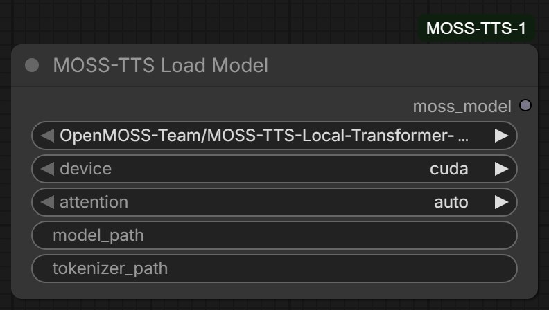

Loads the model once and keeps it in memory, so later runs start immediately.

| Input | Type | Default | Notes |
|---|---|---|---|
| `model_id` | enum | `…MOSS-TTS-Local-Transformer-v1.5 (1.7B)` | `…Local-Transformer-v1.5 (1.7B)` — the default: **48 kHz** stereo, ~12 GB VRAM. `…MOSS-TTS-v1.5 (8B)` — **24 kHz** mono, ~22 GB VRAM. All nodes work with both and output audio at the model's own sample rate. Entries prefixed `local: ` are model folders found under `ComfyUI/models/moss_tts` (or wherever `extra_model_paths.yaml` points that name). |
| `device` | `cuda` \| `cpu` | `cuda` | Falls back to `cpu` when CUDA is unavailable (very slow) |
| `attention` | enum | `auto` | *(optional)* `auto` uses `flash_attention_2` if `flash-attn` is installed, otherwise PyTorch's built-in `sdpa`. Leave it on `auto`. |
| `model_path` | STRING | `""` | *(optional)* Load from this folder instead of the dropdown — the directory that holds `config.json`. Overrides `model_id` when set. See [Using a model you already downloaded](#using-a-model-you-already-downloaded). |
| `tokenizer_path` | STRING | `""` | *(optional)* Folder of the MOSS audio tokenizer. Usually leave empty — a matching tokenizer in a `moss_tts` folder or next to the model is found automatically. Only needed when yours sits somewhere else. |

Precision is chosen for you (bfloat16 on GPU, float32 on CPU).

**Output**: `MOSS_MODEL` — pass to any of the Speak / Voice Clone / Voice Continue / Encode Tokens / Decode Tokens nodes. One model is kept loaded at a time: loading another frees the previous one.

### `MOSS-TTS Speak`

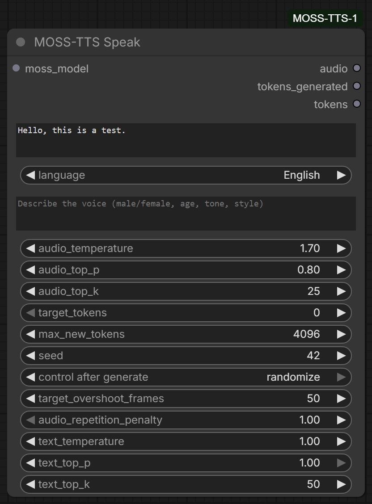

Text-to-speech with no reference audio. MOSS picks a voice from `language` and `instruction` — describe the voice you want in `instruction`.

| Input | Type | Default | Notes |
|---|---|---|---|
| `moss_model` | MOSS_MODEL | — | From the loader |
| `text` | STRING | `Hello, this is a test.` | Multiline |
| `language` | enum | `English` | Also nudges MOSS toward a language-typical base voice |
| `instruction` | STRING | `""` | Voice description — e.g. `"male, warm, elderly narrator"`, `"young female, cheerful, energetic"`, `"deep voice, dramatic, slow"`. Without it, MOSS picks whatever the training-data default was for the language. |
| `audio_temperature` | FLOAT | `1.7` | Sampling temperature |
| `audio_top_p` | FLOAT | `0.8` | Nucleus sampling |
| `audio_top_k` | INT | `25` | Top-k sampling |
| `target_tokens` | INT | `0` | Target duration in audio frames (12.5 per second). `0` = the model decides. |
| `max_new_tokens` | INT | `4096` | Safety cap on generated audio frames |
| `seed` | INT | `42` | Random seed |
| `target_overshoot_frames` | INT | `50` | Runaway cap: with `target_tokens > 0`, MOSS may run at most this many frames past it. `50` = 4 s slack. Ignored when `target_tokens = 0`. |
| `audio_repetition_penalty` | FLOAT | `1.0` | *(optional)* Penalty on repeated audio. `1.0` = off. Mild values (`1.05`–`1.15`) help against droning, tempo freeze or looping syllables; above ~`1.3` it can distort sounds that legitimately repeat. **On the 8B keep it at `1.0`** unless you hear a loop — there it also pushes away from a cloned voice. |
| `text_temperature` | FLOAT | `1.0` | *(optional)* MOSS generates text and audio side by side; this samples the **text** side, which drives pacing. Lower = steadier pacing without flattening the voice. |
| `text_top_p` | FLOAT | `1.0` | *(optional)* Nucleus (top-p) cutoff for the text side. Default `1.0` (off). |
| `text_top_k` | INT | `50` | *(optional)* Top-k cutoff for the text side. Default `50`. |

**Outputs**: `audio` (the model's native format: 48 kHz stereo on the Local-Transformer, 24 kHz mono on the 8B), `tokens_generated` (INT) + `tokens` (`MOSS_TOKENS` — the codes MOSS just emitted, so a voice invented here can be handed to Voice Clone / Voice Continue without ever being encoded from a WAV; see [Token pipeline (encode once)](#token-pipeline-encode-once)).

### `MOSS-TTS Voice Clone`

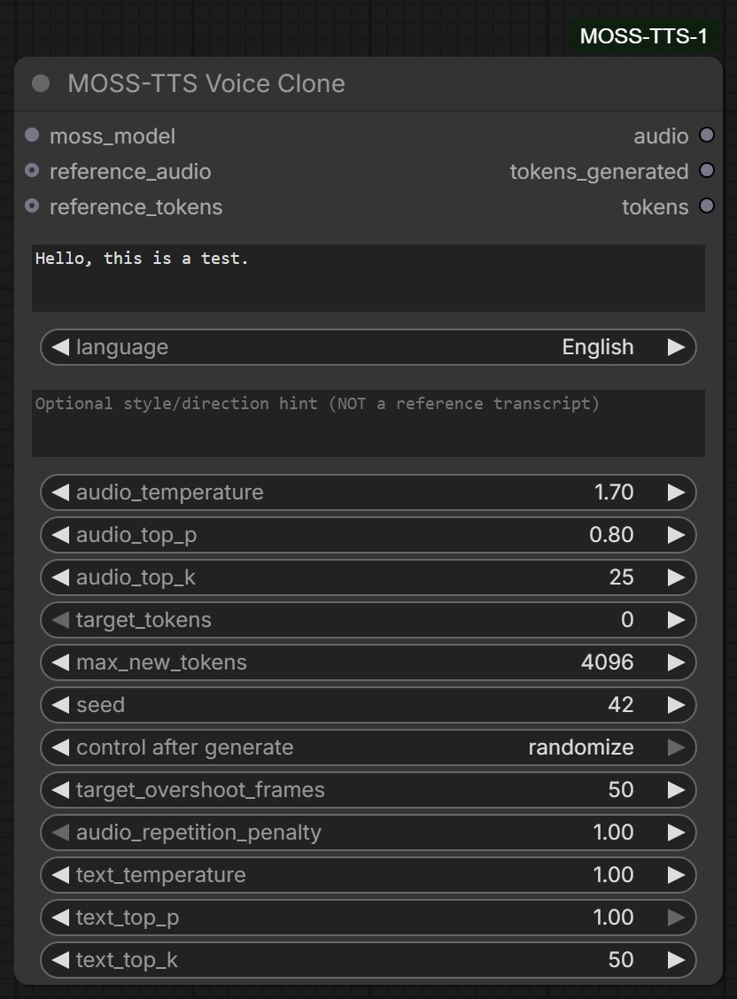

Generates speech from `text` in the voice of `reference_audio` — or of `reference_tokens`, the same reference already encoded.

| Input | Type | Default | Notes |
|---|---|---|---|
| `moss_model` | MOSS_MODEL | — | From the loader |
| `reference_audio` | AUDIO | — | The voice to clone (`Load Audio`, another node's `audio`, …). **At least ~10 s of speech**, 10–20 s is ideal — shorter comes back as gibberish ([Reference rules](#reference-rules)). Wire this **or** `reference_tokens`. |
| `reference_tokens` | MOSS_TOKENS | — | *(optional)* The same reference, already encoded — skips re-encoding it on every run. Same ~10 s minimum. From `Encode Tokens` / `Load Tokens` / `Concat Tokens` or another node's `tokens` output, see [Token pipeline](#token-pipeline-encode-once). |
| `text` | STRING | `Hello, this is a test.` | Multiline |
| `language` | enum | `English` | Full 31-language list: Arabic, Cantonese, Chinese, Czech, Danish, Dutch, English, Finnish, French, German, Greek, Hebrew, Hindi, Hungarian, Italian, Japanese, Korean, Macedonian, Malay, Persian (Farsi), Polish, Portuguese, Romanian, Russian, Spanish, Swahili, Swedish, Tagalog, Thai, Turkish, Vietnamese. See [MOSS README](https://huggingface.co/OpenMOSS-Team/MOSS-TTS-Local-Transformer-v1.5) for language codes / flags. |
| `instruction` | STRING | `""` | Optional free-form style/direction hint. **Not** a reference transcript — MOSS has no reference-text channel. |
| `audio_temperature` | FLOAT | `1.7` | Sampling temperature |
| `audio_top_p` | FLOAT | `0.8` | Nucleus sampling |
| `audio_top_k` | INT | `25` | Top-k sampling |
| `target_tokens` | INT | `0` | Target duration in audio frames (12.5 fps → 375 ≈ 30 s, 750 ≈ 60 s). `0` = the model decides. See [Duration control](#duration-control). |
| `max_new_tokens` | INT | `4096` | Safety cap on generated audio frames (12.5 fps) → default `4096` caps output at ~5 min. |
| `seed` | INT | `42` | Random seed. Same seed + same inputs → identical output. |
| `target_overshoot_frames` | INT | `50` | Runaway cap: with `target_tokens > 0`, MOSS may run at most this many frames past it. `50` = 4 s slack. Ignored when `target_tokens = 0`. |
| `audio_repetition_penalty`, `text_temperature`, `text_top_p`, `text_top_k` | | | *(optional)* Same as on [Speak](#moss-tts-speak). |

**Outputs**:

- `audio` — AUDIO at the model's native rate (48 kHz stereo on the default model, 24 kHz mono on the 8B), ready for `PreviewAudio` / `SaveAudio`
- `tokens_generated` — INT, number of audio frames actually produced (divide by 12.5 for seconds)
- `tokens` — `MOSS_TOKENS`, the codes MOSS just generated. Feed into the next node's `reference_tokens` / `prev_tokens`, optionally through `Concat Tokens`, to keep the whole chain encode-free.

### `MOSS-TTS Voice Continue`

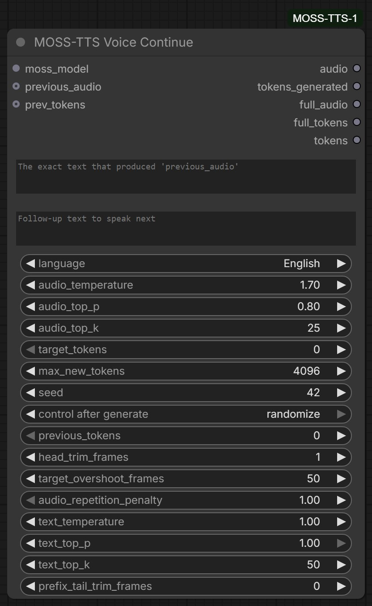

Continues a previous clip in the same voice. MOSS needs the **text of the previous clip** (`previous_text`) to know where it stopped, then speaks your new `text`. The voice comes from the previous audio — no separate reference. Instead of `previous_audio` you can wire `prev_tokens`, the previous segment's codes, which skips re-encoding.

| Input | Type | Default | Notes |
|---|---|---|---|
| `moss_model` | MOSS_MODEL | — | From the loader |
| `previous_audio` | AUDIO | — | The clip to continue (typically the previous node's `audio`). Wire this **or** `prev_tokens` — wire both if you want the `full_audio` output with `prev_tokens`. |
| `prev_tokens` | MOSS_TOKENS | — | *(optional)* The previous segment's codes (its `tokens` output) instead of its audio — no re-encoding, exact length. Not the same as the `previous_tokens` number below. |
| `previous_text` | STRING | `""` | **Exactly the text spoken in `previous_audio` / `prev_tokens`**, word for word. A mismatch produces gibberish — see [Reference rules](#reference-rules). |
| `text` | STRING | `""` | The text to speak next. Must not be empty. |
| `language` | enum | `English` | Same list as Voice Clone |
| `audio_temperature` | FLOAT | `1.7` | Sampling temperature |
| `audio_top_p` | FLOAT | `0.8` | Nucleus sampling |
| `audio_top_k` | INT | `25` | Top-k sampling |
| `target_tokens` | INT | `0` | Duration of the **new** segment in frames (12.5 per second). `0` = the model decides. |
| `max_new_tokens` | INT | `4096` | Safety cap on the new segment |
| `seed` | INT | `42` | Random seed |
| `previous_tokens` | INT | `0` | Exact frame count of `previous_audio`. Wire the `tokens_generated` output of the upstream Speak / Voice Clone / Voice Continue node here for a precise handoff. Leave at `0` to measure from the audio duration (≤ 1 frame off due to rounding). Ignored when `prev_tokens` is wired — the code tensor already carries the exact length. |
| `head_trim_frames` | INT | `1` | Frames cut from the START of the new audio (1 frame = 80 ms). The first frame can carry a little of the previous clip's end; `1` removes it. `0` = off, higher if you still hear it. |
| `target_overshoot_frames` | INT | `50` | Runaway cap: with `target_tokens > 0`, MOSS may run at most this many frames past it. `50` = 4 s slack. Ignored when `target_tokens = 0`. |
| `audio_repetition_penalty`, `text_temperature`, `text_top_p`, `text_top_k` | | | *(optional)* Same as on [Speak](#moss-tts-speak). |
| `prefix_tail_trim_frames` | INT | `0` | *(optional)* **8B only.** Set `-1` when chaining Voice Continue on the 8B — it removes short glitches at the joins, see [The 8B delay seam](#the-8b-delay-seam). `0` = off; on the default model `-1` does nothing. |

**Outputs**:

- `audio` — new segment only, head-trimmed. Use for per-segment QC / preview (you hear just the delta).
- `tokens_generated` — INT, frames of that `audio` (after `head_trim_frames`).
- `full_audio` — `previous_audio` + the new segment, at the model's sample rate, always two channels (dual mono on the 8B). The merged result, and the `previous_audio` for the next segment.
- `full_tokens` — INT, `previous_tokens + tokens_generated`. Wire into the next `previous_tokens` for a precise chain handoff.
- `tokens` — `MOSS_TOKENS`, the codes of the new segment. Wire into the next Continue's `prev_tokens` (directly or through `Concat Tokens`) for an encode-free chain. These are the **untrimmed** codes, so they are `head_trim_frames` longer than `tokens_generated` — see [Caveats](#caveats).

`full_audio` / `full_tokens` need `previous_audio`: in a token-only chain (`prev_tokens` wired, no audio) there is no prior waveform in the graph, so both fall back to the new segment alone.

Same-speaker chain, segment by segment:

```
seg N:   Voice Continue → audio, full_audio, full_tokens
seg N+1: Voice Continue.previous_audio  <-- (seg N).full_audio
         Voice Continue.previous_tokens <-- (seg N).full_tokens
```

Save both `audio` (for QC / retake of just this segment) and `full_audio` (as the prev handoff to the next segment). Retake with a different seed rebuilds `full_audio` from the same starting prefix.

This is right for a few segments. For **long scenes**, pass only the last segment's `audio` as `previous_audio` and exactly its text as `previous_text` — the whole history costs VRAM with every segment (see [Performance & memory](#performance--memory)).

### `MOSS-TTS Estimate Tokens`

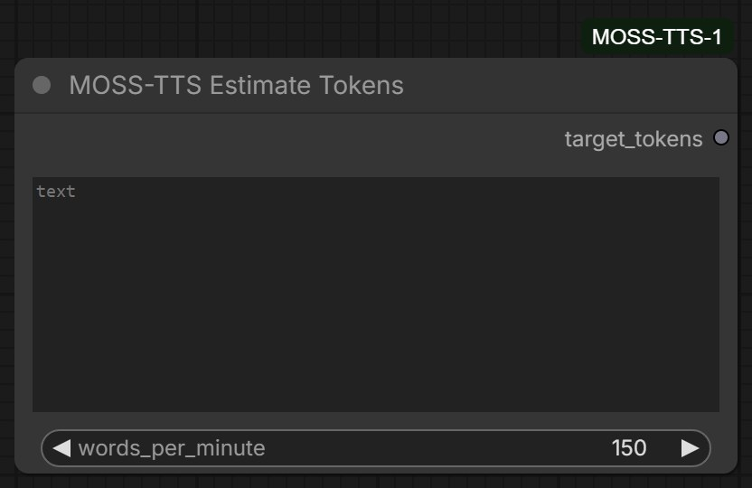

Turns a text into a `target_tokens` estimate you can wire straight into `Speak` / `Voice Clone` / `Voice Continue`.

| Input | Type | Default | Notes |
|---|---|---|---|
| `text` | STRING | `""` | Multiline. Word count via whitespace split; every CJK (Chinese/Japanese/Korean) character counts as a unit of its own, so mixed text works too. |
| `words_per_minute` | FLOAT | `150.0` | 150 = calm audiobook narration, 180 = conversational, 220 = fast. For CJK read as characters-per-minute. |

**Output**: `target_tokens` (INT). Formula: `ceil(word_count / (wpm/60) * 12.5)`.

Need slack for punctuation-heavy passages? Chain a ComfyUI math node (`Multiply` / `Add`) after the output — the estimator deliberately has no built-in buffer so you can compose one that scales with the text.

### `MOSS-TTS Encode Tokens`

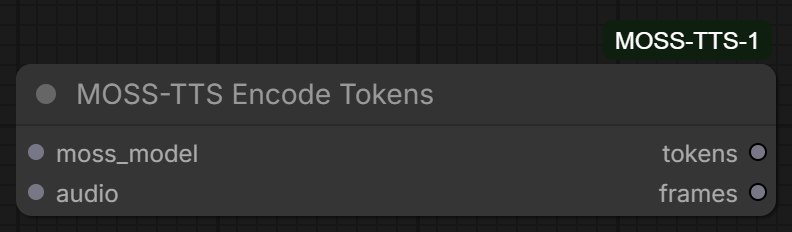

Turns an `AUDIO` clip into `MOSS_TOKENS` using the model's own codec — the one step the whole token pipeline exists to perform exactly once.

| Input | Type | Default | Notes |
|---|---|---|---|
| `moss_model` | MOSS_MODEL | — | From the loader. Codes only work with the model that encoded them. |
| `audio` | AUDIO | — | The clip to encode — the codes are the same as Voice Clone would make from it. Same rules as for any reference: **~10 s or more**, and if the codes become a Voice Continue prefix, `previous_text` must be exactly what this clip says ([Reference rules](#reference-rules)). |

**Outputs**: `tokens` (`MOSS_TOKENS`) + `frames` (INT; divide by 12.5 for seconds).

### `MOSS-TTS Decode Tokens`

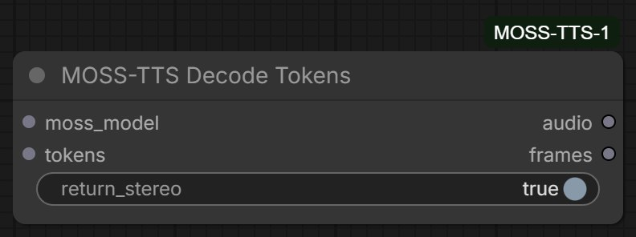

The inverse of `Encode Tokens`: turns `MOSS_TOKENS` back into audio. Use it to hear what a saved token file contains, what a `Concat Tokens` window really holds, or what a `tokens` output sounds like — **without generating anything**. Worth a listen before a long batch: a reference that sounds wrong here will clone wrong.

Decoding involves no sampling — the same codes always give the same audio.

| Input | Type | Default | Notes |
|---|---|---|---|
| `moss_model` | MOSS_MODEL | — | From the loader. The vocoder is part of the model, so decode with the model that produced the codes (a mix-up stops with a clear error). It also sets the output sample rate: 48 kHz for the default model, 24 kHz for the 8B. |
| `tokens` | MOSS_TOKENS | — | Codes to turn back into audio. Any `MOSS_TOKENS` source: `Encode` / `Concat` / `Load Tokens`, or a generate node's `tokens` output. |
| `return_stereo` | BOOLEAN | `true` | *(optional)* Default model only (the 8B is always mono). `true` keeps stereo, exactly like the generate nodes' `audio`; `false` mixes down to mono. |

**Outputs**: `audio` (AUDIO at the model's native rate) + `frames` (INT, the number of code frames decoded; divide by 12.5 for seconds).

Decoding a node's `tokens` output gives back the `audio` it was generated with (for Voice Continue: plus the `head_trim_frames` the audio lost, see [Caveats](#caveats)).

### `MOSS-TTS Concat Tokens`

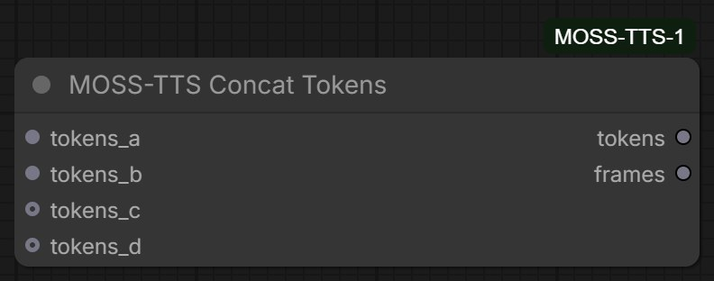

Joins two to four token streams along the time axis. Built for sliding-window references: keep a fixed base anchor (the voice you cloned from) and append the most recent segment(s). Same continuity as concatenating reference WAVs — without touching audio at all: no decode, no re-encode, no resample.

| Input | Type | Default | Notes |
|---|---|---|---|
| `tokens_a` | MOSS_TOKENS | — | First stream. For a sliding window this is the base-voice anchor. |
| `tokens_b` | MOSS_TOKENS | — | Appended after `tokens_a` — e.g. the most recent segment. |
| `tokens_c` | MOSS_TOKENS | — | *(optional)* Appended after `tokens_b`. |
| `tokens_d` | MOSS_TOKENS | — | *(optional)* Appended after `tokens_c`. |

All inputs must come from the same model — a mix-up stops with a clear error.

**Outputs**: `tokens` (concatenated codes) + `frames` (INT total; `frames / 12.5` = seconds, handy for keeping a sliding window inside a duration budget).

### `MOSS-TTS Save Tokens`

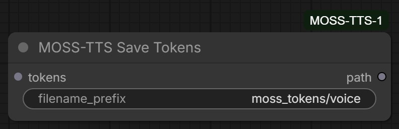

Writes `MOSS_TOKENS` to ComfyUI's output directory and returns the absolute path.

| Input | Type | Default | Notes |
|---|---|---|---|
| `tokens` | MOSS_TOKENS | — | Codes to persist, e.g. from `Encode Tokens` or a generate node's `tokens` output |
| `filename_prefix` | STRING | `moss_tokens/voice` | Path prefix inside ComfyUI's output directory. Subfolders are created automatically, a counter and `.moss_tokens.pt` are appended: `moss_tokens/voice` → `output/moss_tokens/voice_00001_.moss_tokens.pt` |

Load Tokens reads only numbers and refuses anything else, so a token file from someone else cannot run code on your machine.

The path is also shown in the ComfyUI UI and returned by the API (`/history`), so an HTTP-driven pipeline can encode the base voice in one prompt and load the file in every later one.

**Output**: `path` (STRING, absolute).

### `MOSS-TTS Load Tokens`

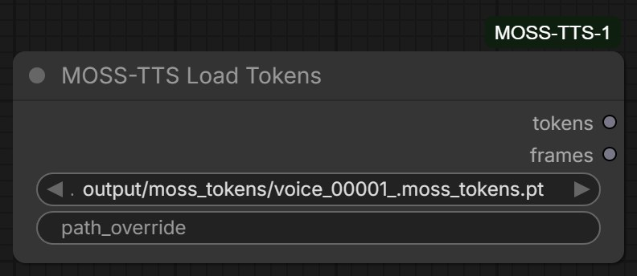

Reads a token file written by `Save Tokens` back into `MOSS_TOKENS`.

| Input | Type | Default | Notes |
|---|---|---|---|
| `path` | dropdown | first entry | **File picker.** Lists every `.moss_tokens.pt` found in ComfyUI's **input** and **output** directory, scanned recursively (`Save Tokens` writes into a subfolder by default). Entries from the output directory carry an `output/` prefix, so identical basenames in both directories stay apart. Files written after the page was loaded show up on reload. |
| `path_override` | STRING | `""` | *(optional)* Explicit path; when non-empty it **replaces** the dropdown selection. Relative to the input directory (output directory as fallback) or absolute. Wire the `path` output of `Save Tokens` into it to load what an earlier run wrote. |

When neither directory holds a token file yet, the dropdown shows a single `(no token files found)` entry; running with it selected fails with an explicit message instead of a confusing "file not found" — use `path_override`, or run `Save Tokens` once and reload.

Overwriting a token file is noticed: the node loads it again on the next run.

**Outputs**: `tokens` (`MOSS_TOKENS`) + `frames` (INT).

---

## Reference rules

Two hard constraints on the *reference* side. Break either and the output is **gibberish** — not a weaker or slightly-off voice, but unusable audio. Neither raises an error, so if a run comes back as garbled speech, check these first.

**1. The reference text must transcribe the reference audio.**
MOSS aligns the spoken reference against its transcript to locate its position in the script. Hand it a pair that does not describe the same speech and the alignment is meaningless — the model produces gibberish. In this nodepack the pair is `Voice Continue`'s `previous_text` ↔ `previous_audio` / `prev_tokens`.

> **Rule: the reference text must transcribe the reference audio. If you trim the audio, trim the transcript to the same point.**

Typical ways to break it:

- Shortening a reference WAV (or a token stream, e.g. building a sliding window with `Concat Tokens`) without shortening its transcript accordingly.
- Pasting the wrong text — a neighbouring paragraph, the *next* segment instead of the previous one, a pre-edit version of the line.
- Chaining segments and passing only the last segment's audio while `previous_text` still holds the whole scene so far (or vice versa).

`Voice Clone` has **no** reference-transcript channel at all (`instruction` is a style hint, not a transcript), so this rule only concerns the continuation path — but it applies to *any* reference audio/text pair you build on top of these nodes.

**2. A too-short reference produces gibberish too.**
The model needs enough acoustic evidence to lock onto a voice. **~5 s is not enough** — aim for **at least ~10 s**, with 10–20 s the sweet spot. This applies identically to `reference_audio` and to pre-encoded `reference_tokens` / `prev_tokens` (~125 frames ≈ 10 s at 12.5 fps): the constraint is about the amount of speech, not the format. Very long references work fine but cost VRAM — see [Performance & memory](#performance--memory).

`Decode Tokens` is the cheap way to check the first half of a pair: listen to the reference the workflow *actually* assembled before spending a batch on it.

---

## The 8B delay seam

Chaining `Voice Continue` on the **8B** can produce short glitches right after each join — a clipped or smeared syllable, a word that dissolves. The default model does not have this problem.

**Fix: set `prefix_tail_trim_frames` to `-1`** on every Voice Continue that runs on the 8B.

Why: the 8B stores its audio codes staggered, so the last ~2.5 s of the previous clip reach the model incomplete and it has to guess them again. `-1` ends the prefix just before that part (31 frames) — the value that tested best.

**What it costs:** MOSS re-speaks those ~2.5 s before continuing, so each new `audio` starts with the end of the previous clip, and `full_audio` contains it twice. Cut that repeat in an audio editor before joining the clips — `head_trim_frames` only goes up to 0.8 s, too short for this.

On the default model there is nothing to do: `-1` does nothing there. Even with the trim, a chained 8B continuation shows an occasional short error — that is the model.

---

## Pronunciation control (IPA)

You can spell a word phonetically and MOSS will say it that way — but **only on the 8B**, and only if the surrounding text is long enough.

**Model support:**

| Model | Inline IPA | Whole-sentence IPA |
|---|---|---|
| `MOSS-TTS-v1.5` (8B) | **yes** | **yes** |
| `MOSS-TTS-Local-Transformer-v1.5` (default) | no | no |

The default model reads the slashes as characters — `/veːk/` comes out as something like "fek". No amount of text length changes that.

**The trap: too-short text.** With only a sentence or two, voice cloning does not engage properly, and IPA appears not to work *even on the 8B*. Such a test makes the model look unable to do IPA. Give it several sentences before judging. This is the same minimum-length effect described under [Reference rules](#reference-rules), now on the *text* side.

**Both forms work on the 8B:**

```
Er ging den /veːk/ entlang.          # inline — one word corrected, rest normal
/eːɐ̯ ɡɪŋ deːn veːk ɛntˈlaŋ/          # whole sentence in slashes
```

Inline is the useful one: it fixes a single stubborn word while leaving the model's own prosody in charge of everything else.

**What this is good for.** Some mispronunciations are not random. Compound nouns, loanwords and words whose stress depends on meaning (German `der Weg` /veːk/ vs. `weg` /vɛk/) get read the same wrong way on every retry, so regenerating with a new seed does not help. A phonetic spelling fixes those deterministically. Orthographic respelling ("Lihra" for "Lyra") does **not** work — MOSS ignores it.

**Caveat — bare digits** can be misread (`12345` came out as "1212455"). Write numbers out (`zwölftausend…`).

---

## Token pipeline (encode once)

MOSS turns audio into **codes** (`MOSS_TOKENS` in this pack: 12.5 frames per second, one frame = 80 ms) before it can use it as a voice reference, and it generates codes, too. The token nodes let you keep those codes:

- encode a voice reference **once**, save it, and reuse it in every later run — no re-encoding;
- feed a generated segment straight into the next one without ever turning it into a WAV;
- listen to any code stream with `Decode Tokens`.

### Why it matters

Encoding a reference takes time on every run — with a long reference (a minute or more, e.g. a sliding window over a narration) several seconds, and it does not get faster when you run many requests at once. Encoding it once removes that step.

### Encode once, chain tokens

```
once, ever:
[Load Audio (base voice)] -> [Encode Tokens] -> [Save Tokens] -> path

every run:
[Load Tokens (base)]  -> tokens_a ┐
                                  ├-> [Concat Tokens] -> tokens ┐
[tokens of prev seg]  -> tokens_b ┘                             │
                                                                v
                                                 [Voice Clone].reference_tokens
                                             (or [Voice Continue].prev_tokens)
                                                                │
                                                                v
                                                    audio + tokens (emitted)
                                                                │
                                        <───────────────────────┘
                                        (feeds the next run's tokens_b)
```

1. **Encode once** — run `Encode Tokens` on the base voice clip, and `Save Tokens` if it should survive a restart. An HTTP-driven pipeline saves in one prompt and just runs `Load Tokens` in every later one. In the UI, pick the file from `Load Tokens`' dropdown (a fresh save shows up after a page reload); over HTTP, put the path into `path_override`.
2. **Build the reference** — `Concat Tokens` with the base anchor as `tokens_a` and the most recent segment(s) after it.
3. **Generate** — wire the result into `Voice Clone.reference_tokens` (or `Voice Continue.prev_tokens`) — the audio input can then stay unwired (on Voice Continue, wire it only if you want `full_audio`).
4. **Chain** — take that node's `tokens` output as the "recent segment" input of the next `Concat Tokens`. Nothing in the loop touches the codec again.

`Speak` emits `tokens` too, so even a reference-free voice invented on the fly enters the chain without a WAV round-trip.

Every link in that loop can be **auditioned**: hang a `Decode Tokens` → `PreviewAudio` off any `MOSS_TOKENS` connection to hear what is really in it — the saved base voice, the concatenated reference window, the segment just emitted. It costs one codec pass and changes nothing in the chain. Worth doing once when a chain misbehaves, because the two failure modes below are inaudible in the graph but obvious in the ear.

### Caveats

- **A trimmed token stream needs a trimmed `previous_text`.** When a sliding window with `Concat Tokens` drops old frames, drop their words from the text too — `Concat Tokens` only sees codes and cannot check it. See [Reference rules](#reference-rules).
- **Tokens need the same ~10 s as audio** (~125 frames; `frames / 12.5` = seconds on every token node). A sliding window that shrinks below that produces gibberish.
- **`head_trim_frames` does not apply to tokens.** Voice Continue's `tokens` output holds the whole new segment; only the `audio` loses its first `head_trim_frames` (default `1` = 80 ms). If audio and tokens have to line up 1:1, set `head_trim_frames = 0`. Do **not** cut the tokens to match the trimmed audio — MOSS needs them whole as the next prefix.
- **`full_audio` / `full_tokens` still need `previous_audio`.** With only `prev_tokens` wired there is no prior waveform in the graph, so those two outputs fall back to the new segment alone. Chain `Concat Tokens` on the `tokens` output if you want the cumulative *code* stream.
- **Loudness:** `Encode Tokens` normalises each clip on its own, so two concatenated token streams can differ slightly in level from one WAV made of both. Both work.
- **Tokens are model-specific.** Codes from the default model do not work with the 8B and vice versa — a mix-up stops with a clear error. Re-encode the reference when you switch models.
- **No network paths in path inputs (Windows).** `path_override`, `model_path`, `tokenizer_path` and Save Tokens' `filename_prefix` refuse UNC paths (`\\host\share\…`): Windows would hand that host your NTLM hash as soon as the path is touched, and a shared workflow must not be able to do that. A share mapped to a drive letter works, and so does a path inside ComfyUI's own input/output directory, which may itself be a share.

---

## Duration control

`target_tokens` on `Speak`, `Voice Clone` and `Voice Continue` sets the length of the speech in frames (12.5 per second), and **MOSS sticks to it** — the same text with `100`, `200`, `400` comes out at roughly 8, 16 and 32 s.

Practical uses:

- **Consistent narration pace across a batch**: fix `wpm = 150` in `Estimate Tokens`, MOSS will read every chapter at the same tempo regardless of length.
- **Speech-rate control without style prompting**: chain a multiplier after the estimator. `× 1.4` = slow / dramatic, `× 0.75` = urgent / rushed. Cleaner than adjectives in the `instruction` field.
- **Fixed video/audio slots**: your video shot is 8 s → set `target_tokens = 100`. MOSS fits into that slot.
- **Continuation length steering**: `Voice Continue.target_tokens = 375` → about 30 s of extra audio.

`max_new_tokens` is something else: a hard safety cap in frames, on both models. Keep it comfortably above `target_tokens`; the default `4096` (~5 min) is usually plenty. With a `target_tokens` set, `target_overshoot_frames` (default 50 = 4 s) additionally stops a run that overshoots the target.

---

## Example workflows

### Full pipeline — Speak → Clone → Continue (downloadable)

The bundled [`example_workflows/MOSS-TTS_Full.json`](example_workflows/MOSS-TTS_Full.json) wires the whole chain end to end. Open it from ComfyUI's **Templates** browser (listed under this pack) or drop the JSON on the canvas. It is set up in German: replace the text inside **Speak** and the two `Text (Multiline)` boxes (`String (Multiline)` in older ComfyUI), and set `language` on the three MOSS nodes. Everything else is pre-wired.

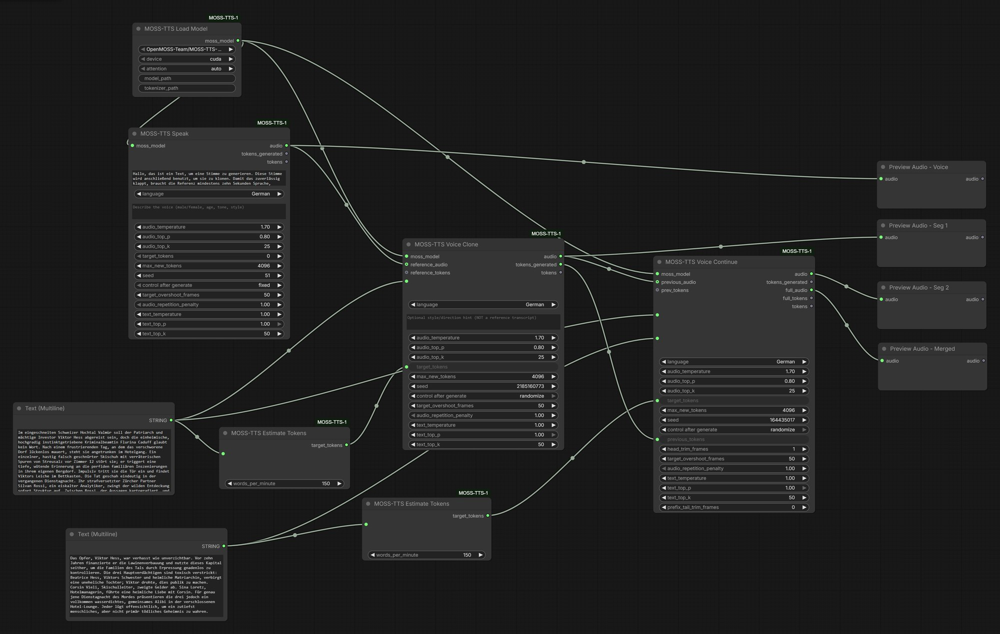

1. **Load Model** once, fanned out to all three generators.
2. **Speak** invents a voice from a seed text of three sentences (no reference) → *Preview: Voice*. Its audio becomes the clone's reference, so keep that text at 10 s of speech or more.
3. **Voice Clone** takes that audio as `reference_audio` and narrates segment 1 in the same voice; an **Estimate Tokens** node sets its duration → *Preview: Seg 1*. Its `tokens_generated` is wired forward as the exact prefix length.
4. **Voice Continue** takes the clone's `audio` + `tokens_generated` and narrates segment 2 — inheriting the voice and continuing the script → *Preview: Seg 2*. Its `full_audio` output is the merged single-take result → *Preview: Merged*.

This is the canonical "create a voice, then narrate a multi-segment passage in it" pattern; the individual node/workflow shots below break out each piece.

### Reference-free narration & single voice clone

**Reference-free narration** — Load Model → Speak, with an Estimate Tokens node feeding the duration hint, a Preview on the audio and `Save Tokens` keeping the voice's codes for later clones:

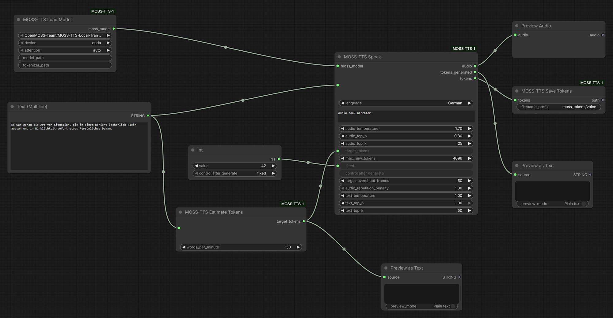

**Voice clone from a reference clip** — a `Load Audio` reference + Load Model → Voice Clone, again with Estimate Tokens driving `target_tokens`:

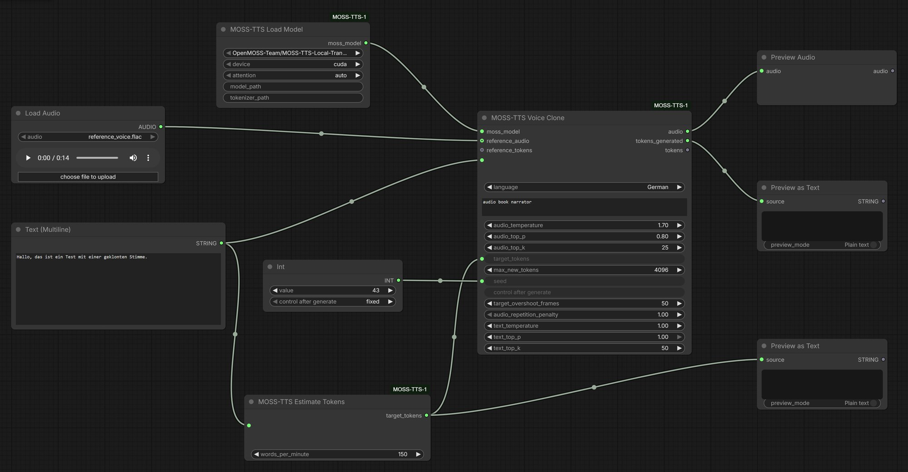

The wiring in condensed form:

**Basic voice clone with automatic duration:**

```
[Load Audio]        [MOSS-TTS Load Model]
      \                  /
       > [MOSS-TTS Voice Clone] -> [Save Audio]
                 ^
    [text]  [MOSS-TTS Estimate Tokens] -> target_tokens
```

**Speech-rate control:**

```
[text] -> [Estimate Tokens] -> [Multiply INT × 1.4] -> Voice Clone.target_tokens
```

Same audio reference, same seed, same text — but 40% slower / more dramatic. Or `× 0.75` for urgent.

**Continuation chain:**

```
[LoadAudio ref]  [Load Model]
      \             /
       > [Voice Clone] -> audio ─────────────┐
[part 1 text] -> Voice Clone.text            │
       [Voice Clone] -> tokens_generated ─┐  │
                                          v  v
[part 1 text] -------> Voice Continue.previous_text
                       Voice Continue.previous_audio
                       Voice Continue.previous_tokens (exact prefix len)
[part 2 text] -------> Voice Continue.text
[Estimate Tokens (part 2)] -> Voice Continue.target_tokens
                                          │
                                          v
                             [Save Audio (part 2 only)]
```

Route both the audio and the `tokens_generated` from the upstream node — the frame count keeps the prefix length exact. Voice Continue reads `part 1 text` as "already said" and speaks `part 2 text`.

For part 3, feed `part 1 + part 2` as the new `previous_text`, wire Voice Continue's own outputs forward, and so on — for long scenes see [Performance & memory](#performance--memory).

The same chain runs **encode-free** if you route the upstream `tokens` output (`MOSS_TOKENS`) into `prev_tokens` instead of routing the audio — see [Token pipeline (encode once)](#token-pipeline-encode-once).

---

## Performance & memory

Figures below are for the default model (Local-Transformer), a 75-character German sentence, RTX 5090. The **8B** model loads a larger checkpoint (~17 GB) and needs ~22 GB VRAM, so both load and generation are correspondingly slower.

| Phase | Time (default model) |
|---|---|
| Audio tokenizer load | ~21 s |
| Model load | ~16 s |
| Generation (4.72 s of audio) | **~2.7 s** |

A model is loaded once and then stays in memory; switching to another model (or another `attention` / `tokenizer_path`) frees the previous one first, so two never share your VRAM. Once loaded, generation runs faster than real time on modern hardware.

VRAM: ~12 GB for the default model, ~22 GB for the 8B. Very long texts or references push it higher. For the default model a 24 GB card has comfortable headroom; the 8B wants a 24 GB card with little else resident.

**References cost VRAM.** Whatever MOSS continues from — `reference_audio`, `previous_audio` or their tokens — stays in memory while it generates: about **1 GB per ~20 s** of reference (measured on the default model, similar on the 8B).

- **Keep references at 10–20 s.** A 2-minute clip adds several GB before generation even starts.
- **Tokens save the encoding, not the memory** — a token reference costs as much VRAM as the same audio.
- **Don't let the history grow.** Chaining whole scenes as `previous_audio` adds VRAM with every segment until it runs out. Pass only the **last** segment's audio — **and cut `previous_text` to exactly that segment's text**, or the output turns to gibberish (see [Reference rules](#reference-rules)).
- Watch `nvidia-smi` during a long chain; with a single-segment prefix it stays flat.

---

## Troubleshooting

- **Output is gibberish — `previous_text` does not match the previous audio.** Usually a shortened clip or token window whose text was left at full length, or the wrong paragraph. Listen to the prefix with `Decode Tokens` and read `previous_text` next to it. See [Reference rules](#reference-rules).
- **Output is gibberish — the reference is too short.** Below ~10 s MOSS cannot lock onto the voice; use 10–20 s.
- **`AttributeError: module 'transformers.processing_utils' has no attribute 'MODALITY_TO_BASE_CLASS_MAPPING'` (suggests `AUTO_TO_BASE_CLASS_MAPPING`)**: you are on transformers 4.x and loading a model whose code needs 5.x — the **8B** always, the Local-Transformer only in an old cached build. Upgrade transformers in ComfyUI's Python env: `python -m pip install -U "transformers>=5.5.1"` (needs Python 3.10+). The loader's own error message prints the same command.
- **`TypeError: non-default argument 'sampling_rate' follows default argument …`**: transformers 5.4.0 or 5.5.0 — upgrade as above, or see [the install gotcha](#known-install-gotcha--configuration_moss_audio_tokenizerpy-dataclass-ordering).
- **Voice Continue shows odd values after an update (e.g. `audio_repetition_penalty` below its minimum, `text_top_k` = 1, `prefix_tail_trim_frames` = 50)**: only workflows saved with a 0.6.1–0.6.3 test build of this pack are affected; workflows from the regular 0.5.x releases load unchanged. Re-enter that node's values once, or replace the node.
- **`Can't load the model … pytorch_model.bin`**: your model.safetensors download stalled. Re-run `huggingface_hub.hf_hub_download(repo_id=..., filename=...)` for the file that stalled — `model.safetensors` for the Local-Transformer, one of the `model-0000N-of-00004.safetensors` shards for the 8B. Often caused by low disk space in `~/.cache/huggingface`.
- **`std::bad_alloc` on `import torchcodec`**: your installed `torchcodec` version was compiled against a different torch. Either install the torchcodec version that matches your torch (see [torchcodec's compatibility table](https://github.com/pytorch/torchcodec#installing-torchcodec)) or `pip uninstall torchcodec`. The MOSS pipeline itself does **not** require torchcodec.
- **`ImportError: TorchCodec is required for save_with_torchcodec / load_with_torchcodec`**: an outdated copy of this nodepack — update it. The current version needs no `torchcodec`.
- **It downloads anyway, although the model is on disk.** The model is only half of the install — MOSS fetches its audio tokenizer separately. On a successful local load the log says `[MOSS-TTS] using local audio tokenizer '…' (48000 Hz)`. If it says `none of the local audio tokenizers matches this model's … Hz` instead, the one you have belongs to the other model: **`MOSS-Audio-Tokenizer-v2` (48 kHz) goes with the default model, `MOSS-Audio-Tokenizer` (24 kHz) with the 8B.** The wrong one would produce noise, so nothing is guessed.
- **No `local: …` entries in the dropdown.** The folder must contain `config.json` *directly* — a Hugging Face snapshot nested one level deeper is not seen. A repo cloned without Git LFS *is* listed (its small `config.json` is a real file) but fails to load — the weights are only pointers; fetch them with `git lfs pull`. The list is rebuilt on every UI refresh, so reload the browser rather than restarting ComfyUI. If nothing helps, `model_path` bypasses the dropdown entirely and its error message says what it did find.
- **Pause markers like `[pause 1.2s]`**: the 8B's model card documents inline `[pause X.Ys]` markers as supported. There is no parser in the code — it is learned behaviour, so treat the length as approximate. The Local-Transformer documents no such marker. For guaranteed gaps, generate separate clips and join them with a silence spacer in ComfyUI, or chain `Voice Continue`.

---

## License

- **This nodepack**: [MIT](./LICENSE)
- **MOSS-TTS v1.5 models & code** ([Local-Transformer](https://huggingface.co/OpenMOSS-Team/MOSS-TTS-Local-Transformer-v1.5) and [8B](https://huggingface.co/OpenMOSS-Team/MOSS-TTS-v1.5)): Apache 2.0, copyright OpenMOSS-Team.

## Credits

- Model: [OpenMOSS-Team](https://github.com/OpenMOSS) / [MOSS-TTS](https://github.com/OpenMOSS/MOSS-TTS)
- Wrapper: this repo — a thin bridge to ComfyUI's `AUDIO` type and its category tree.

Not affiliated with OpenMOSS. Star the [upstream model](https://huggingface.co/OpenMOSS-Team/MOSS-TTS-Local-Transformer-v1.5) if you like the work.
